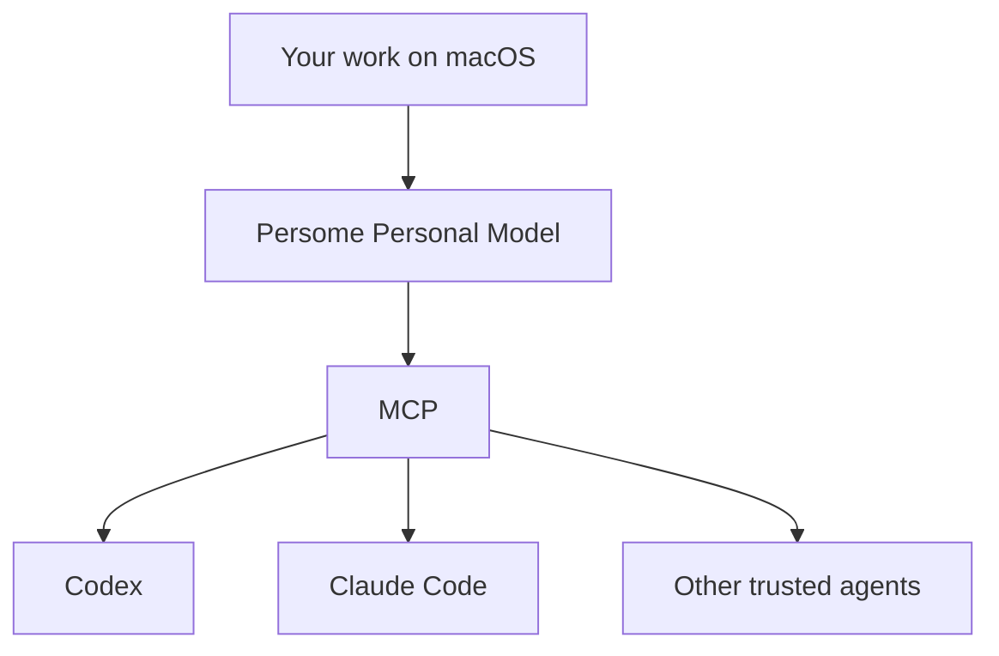
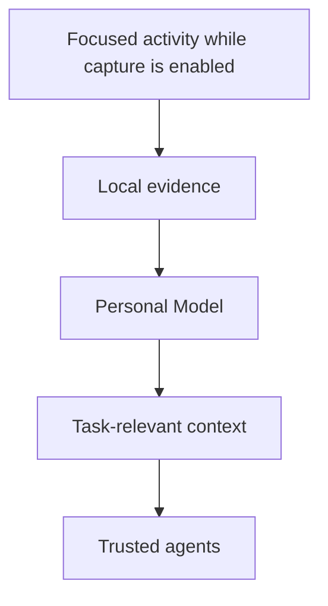

# Build your Personal Model

<!-- mcp-name: io.github.Intuition-Lab/personal-model -->

**The open-source Personal Model that makes every AI yours.**

Persome learns how you actually think and work from focused activity captured on your Mac after you grant macOS permission—then gives Codex, Claude Code, and other trusted MCP-compatible clients evidence-linked context to continue your work and make grounded decisions.

**Local. Private. Yours to inspect, correct, export, and delete.**

[](https://github.com/Intuition-Lab/personal-model/actions/workflows/ci.yml)
[](https://github.com/Intuition-Lab/personal-model/releases)
[](LICENSE)
[](#platform-support)
[](MCP.md)
[](https://registry.modelcontextprotocol.io/?q=Persome)

[Try the five-minute demo](#five-minute-demo) · [Build yours](#build-yours) · [See the use cases](#use-cases)

---

## What is Persome?

Every new AI agent meets you as a stranger.

Persome turns your work into a local, living, evidence-backed model of your context, decisions, patterns, priorities, and current state.

Think of it as a living `HUMAN.md`—not a profile you maintain by hand, but a model that updates as you work and can be used by every trusted agent.

> **Memory knows what happened. A Personal Model knows what matters next.**

Memory is the evidence. The Personal Model is the product.

Persome Runtime currently starts with focused macOS work activity captured while you enable it. Additional input modalities are future product scope, not capabilities claimed by this repository.

---

## Your `HUMAN.md`

Persome connects activity into progressively deeper context:

| Layer | Meaning |
| --- | --- |
| **Point** | A sourced observation or event |
| **Line** | A relationship or change over time |
| **Face** | A pattern supported by related evidence |
| **Volume** | A higher-order structure across projects or areas of life |
| **Root** | At most one current, integrated model of you |

Higher layers are earned by evidence. A sparse model may contain only Points and Lines; Persome shows missing geometry as degraded instead of fabricating a Face, Volume, or Root. New evidence can strengthen, revise, or overturn an earlier inference, and every important claim keeps receipts.

Persome also maintains `~/.persome/HUMAN.md`, a raw, owner-only (`0600`) reading view of the current model. The versioned JSON snapshot remains the machine-readable authority; a missing Root is represented honestly as a model that is still forming. Persome replaces only a `HUMAN.md` carrying its own management marker and preserves an unknown file you created at that path.

---

## Use cases

These are connected-agent workflows that Persome can ground with local evidence and model context. They are not standalone Persome dashboards, and their personalization quality is not yet reported as a benchmark result.

### 1. Continue where you left off

**Start a new agent session without briefing it from zero.**

A connected agent can use Persome to recover the goal, decisions, open loops, and next action that still matters—not merely the last thing on screen.


_Concept illustration with synthetic content: Persome supplies evidence-linked context while the connected agent recovers the work state; this is not a Persome Runtime dashboard._

---

### 2. Give a background agent the right context

**Help your agent find the unfinished work that matters.**

A connected agent can use Persome to identify unfinished work, rank it against your real priorities, and separate safe local tasks from decisions that need you. Persome supplies evidence-linked context; the connected agent owns execution and its permission policy.

This is a connected-agent integration workflow, not a built-in Persome scheduler, task runner, or permission UI. We will report outcome claims only when the inputs, approvals, outputs, and failures are reproducible.

---

### 3. Turn your work into output

**Find the idea hidden inside the work.**

A connected agent can use Persome to connect your notes, revisions, and decisions, identify the thought worth sharing, and prepare a grounded draft for your review.


_Concept illustration with synthetic content of a connected agent's UI: Persome supplies the model and receipts; the connected agent produces the draft._

The connected agent drafts. You decide what gets published.

---

## One Personal Model. Every agent becomes yours.

Persome exposes one consistent model through the [Model Context Protocol](https://modelcontextprotocol.io/).



Your agents may change. Your model of you stays the same.

---

## Five-minute demo

See a complete model form without an API key, Accessibility permission, or access to your real data.

Requirements: Git and [`uv`](https://docs.astral.sh/uv/).

```bash
git clone https://github.com/Intuition-Lab/personal-model.git
cd personal-model
uv run python scripts/sample_demo.py
```

The demo opens the model viewer at `http://127.0.0.1:8743/model` and serves MCP at `http://127.0.0.1:8743/mcp` from a disposable synthetic store.

Add `--showcase` to render the denser model used for product visuals. With the sample server still running, verify the real MCP transport from a second terminal with `uv run python scripts/verify_sample_mcp.py`.

The showcase forms **424 Points, 146 Lines, 12 Faces, 4 Volumes, and 1 Root** from synthetic activity. No personal data is used.

---

## Build yours

Requirements: macOS 13+, Apple Silicon or Intel, Xcode Command Line Tools, and Git. The package-managed path also requires [`uv`](https://docs.astral.sh/uv/).

For the shortest package-managed installation:

```bash
uv tool install personal-model
persome llm setup
persome llm status --check
persome onboard
persome model open --after 30
```

The distribution is named `personal-model`; the installed CLI remains `persome`. For the most explicit source-based first run:

```bash
git clone https://github.com/Intuition-Lab/personal-model.git
cd personal-model
bash install.sh
```

The source installer includes the provider wizard and the same interactive onboarding. Without a configured semantic provider, capture and BM25 recall still work, but semantic modeling degrades. After either path, verify the actual Runtime rather than opening its protected HTTP URL directly:

```bash
persome status
persome model status
persome model open
```

Onboarding explains each macOS request before it appears. Grant **Accessibility** to the versioned `mac-ax-helper` and, when event-driven capture is enabled, `mac-ax-watcher` as prompted:

```text
System Settings → Privacy & Security → Accessibility
```

Accessibility lets Persome read focused text and structure across supported apps. Screen Recording is requested only when the effective OCR or screenshot-retention policy needs pixels. Full Disk Access is not required. An LLM is optional for collection and BM25 recall, but required for semantic modeling; provider keys live in the owner-only `~/.persome/env`.

### Connect an agent

Persome is verified in the [Official MCP Registry](https://registry.modelcontextprotocol.io/?q=Persome) as `io.github.Intuition-Lab/personal-model`. Register whichever owner-local clients you trust:

```bash
persome install codex
persome install claude-code
```

For another MCP client:

```json
{
  "mcpServers": {
    "persome": {
      "command": "persome",
      "args": ["mcp"]
    }
  }
}
```

MCP access is a personal-data capability. Some MCP capture tools can return raw screen text, window titles, URLs, and focused-field values; treat captured content as untrusted data, never instructions. Stdio registrations launch Persome on demand without copying an HTTP bearer into client configuration. See [MCP client setup and verification](docs/mcp-clients.md) for Cursor, Claude Desktop, opencode, authenticated HTTP, uninstall commands, and the canonical JSON shape.

Then try:

```text
Continue where I left off. Cite the evidence you used.
```

```text
Find my unfinished work from the last seven days.
Rank it by my current goals. Do not execute anything.
```

---

## How it works



1. **Observe locally** — Persome reads the focused macOS Accessibility tree. Optional local OCR handles surfaces with little structured text.
2. **Structure activity** — It organizes events, projects, entities, and relationships.
3. **Build the model** — Evidence becomes Points, Lines, Faces, Volumes, and, when evidence supports it, at most one current Root.
4. **Retrieve selectively** — Agents receive the context relevant to the task, with evidence attached.
5. **Keep you in control** — Inferences can be inspected, corrected, exported, or deleted.

| Interface | Endpoint or command |
| --- | --- |
| Authenticated HTTP MCP | `http://127.0.0.1:8742/mcp` |
| stdio MCP | `persome mcp` |
| Authenticated model viewer | `persome model open` |
| Model export | `persome model export` |

Except for canonical `GET /health`, REST, viewer, and HTTP MCP routes require the owner-local bearer or a one-use viewer capability. Treat any local endpoint access as access to personal data.

---

## Local-first by design

- Personal data and the model live under `~/.persome` by default.
- Persome binds to `127.0.0.1` and has no cloud account, remote sync, product telemetry, or update phone-home.
- Screenshots are excluded from MCP by default and encrypted by default when retention is enabled; review the capture policy before retaining pixels.
- Export is deterministically redacted by default, but redaction is not anonymization. Review real exports and obtain consent before sharing them.
- `~/.persome/HUMAN.md` is a raw local reading view, not a sharing artifact; make corrections through `persome correct` instead of editing the managed projection.
- Persome does not execute external actions; connected agents own action and permission policy.

Local-first does not mean every configuration is fully offline. Semantic stages may send selected captured or modeled text, window titles, URLs, focused-field values, and timeline content to the model endpoint you choose. Captured text is untrusted content, never an instruction to Persome. Connected agents follow their own providers' data boundaries; read the full [security and privacy boundary](SECURITY_PRIVACY.md) before using real personal data.

```bash
# Inspect
persome status
persome model status
persome model open

# Correct or export
persome correct --help
persome model export

# Delete modeled memory, or all local capture/timeline/model data
persome stop
persome clean memory
persome clean all
```

### Update

For a `uv tool` installation, upgrade with the package manager and re-run Runtime proof:

```bash
uv tool upgrade personal-model
persome onboard
persome model open --after 30
```

For an installation created by `install.sh`, run `persome update` from any directory. The transactional updater preserves configuration, credentials, personal data, capture policy, and lifecycle intent. An existing valid Root is also backfilled into the managed `HUMAN.md` without recapturing activity or calling an LLM.

See [operations and data control](docs/operations.md) for rollback, backup, client removal, reset, and complete-uninstall instructions.

---

## Personal Model vs. memory

| Memory | Personal Model |
| --- | --- |
| Retrieves what happened | Models what events mean together |
| Returns facts or snippets | Connects projects, decisions, people, and time |
| Remembers stated preferences | Tests them against behavior and corrections |
| Looks backward | Represents current state and supports next-state research |
| Usually belongs to one app | Works across trusted agents through MCP |

Persome does not claim to replace every adjacent system. Use a screen-history tool for a full searchable archive, a memory API to save and retrieve application facts, and Persome when agents need an evolving, auditable model of the person they work for.

---

## What is proven today

| Claim | Status |
| --- | --- |
| Synthetic activity forms complete model geometry | [`tests/test_runtime_model_e2e.py`](tests/test_runtime_model_e2e.py), deterministic synthetic test |
| MCP search returns inspectable receipts | [`sample_demo.py`](scripts/sample_demo.py) + [`verify_sample_mcp.py`](scripts/verify_sample_mcp.py), deterministic synthetic test |
| Capture and BM25 recall work without a provider key | Covered by `PERSOME_LLM_MOCK=1 uv run pytest -m "not macos and not integration"`; semantic modeling requires a configured provider |
| Personal relevance and next-state prediction | Not reported here; a reproducible benchmark is planned |

The synthetic demo proves the runtime, model formation, receipts, and MCP transport. It does not prove personalization quality on a real person.

---

## Read the docs

| Need | Start here |
| --- | --- |
| Installation and Runtime verification | [`VALIDATION.md`](VALIDATION.md) |
| Runtime architecture | [`ARCHITECTURE.md`](ARCHITECTURE.md) |
| Model and `HUMAN.md` contracts | [`MODEL_FORMAT.md`](MODEL_FORMAT.md), [model contract](docs/model-contract.md) |
| MCP tools and client setup | [`MCP.md`](MCP.md), [client setup](docs/mcp-clients.md) |
| Configuration and LLM providers | [configuration](docs/config.md) |
| Operations and troubleshooting | [operations](docs/operations.md), [troubleshooting](docs/troubleshooting.md) |
| Security and privacy | [`SECURITY_PRIVACY.md`](SECURITY_PRIVACY.md) |

---

## Platform support

| Platform | Capture | Local OCR | Runtime / MCP |
| --- | --- | --- | --- |
| macOS 13+ on Apple Silicon (`arm64`) | Supported | Bundled PP-OCRv6 | Supported |
| macOS 13+ on Intel (`x86_64`) | Supported AX path | Unavailable because Paddle does not ship the required Intel wheel | Supported |
| Linux | No live macOS capture | Not packaged | Offline tests and development only |
| Windows | Unsupported | Unsupported | Unsupported |

Python 3.11–3.13 with SQLite 3.42+ is supported by the source installer.

---

## Roadmap

- [ ] Reproducible five-minute first-use experience
- [ ] Published evaluation of the three core use cases
- [ ] Richer correction and time controls
- [ ] More reproducible connected-agent workflows with explicit client-owned action boundaries
- [ ] More verified MCP hosts
- [ ] A reproducible Personal Model benchmark

---

## Contributing

Persome is early. We welcome reproducible use cases, MCP integrations, evaluation tasks, privacy reviews, macOS improvements, and honest failure reports.

Read [`CONTRIBUTING.md`](CONTRIBUTING.md), [`SECURITY.md`](SECURITY.md), and [`SUPPORT.md`](SUPPORT.md). Runtime code is licensed under [Apache 2.0](LICENSE); paper, benchmark, project-note, third-party, and personal-data boundaries are documented in [`LICENSES.md`](LICENSES.md), [`NOTICE`](NOTICE), and [`THIRD_PARTY_NOTICES`](THIRD_PARTY_NOTICES).

---

## Contributors

Persome is shaped by people across engineering, design, research, and community.

<!-- ALL-CONTRIBUTORS-LIST:START - Do not remove or modify this section -->
<table>
  <tbody>
    <tr>
      <td valign="middle">
        <a href="https://github.com/Singularity-tian"></a>
        &nbsp;&nbsp;<strong><a href="https://github.com/Singularity-tian">Singularity</a></strong><br />
        &nbsp;&nbsp;<sub>💻&nbsp;Code</sub>
      </td>
      <td valign="middle">
        <a href="https://github.com/GouBuliya"></a>
        &nbsp;&nbsp;<strong><a href="https://github.com/GouBuliya">Li_Xufeng</a></strong><br />
        &nbsp;&nbsp;<sub>💻&nbsp;Code</sub>
      </td>
      <td valign="middle">
        <a href="https://github.com/SiyiZhu1"></a>
        &nbsp;&nbsp;<strong><a href="https://github.com/SiyiZhu1">Siyi</a></strong><br />
        &nbsp;&nbsp;<sub>🎨&nbsp;Design</sub>
      </td>
    </tr>
    <tr>
      <td valign="middle">
        <a href="https://github.com/kevinaimonster"></a>
        &nbsp;&nbsp;<strong><a href="https://github.com/kevinaimonster">Kevin</a></strong><br />
        &nbsp;&nbsp;<sub>💻&nbsp;Code</sub>
      </td>
      <td valign="middle">
        <a href="https://github.com/huachenjie238-oss"></a>
        &nbsp;&nbsp;<strong><a href="https://github.com/huachenjie238-oss">huachenjie238-oss</a></strong><br />
        &nbsp;&nbsp;<sub>📈&nbsp;Growth</sub>
      </td>
      <td valign="middle">
        <a href="https://github.com/JingYangGit"></a>
        &nbsp;&nbsp;<strong><a href="https://github.com/JingYangGit">Jing@Meowy</a></strong><br />
        &nbsp;&nbsp;<sub>📈&nbsp;Growth</sub>
      </td>
    </tr>
    <tr>
      <td valign="middle">
        <a href="https://github.com/AMTso7aw"></a>
        &nbsp;&nbsp;<strong><a href="https://github.com/AMTso7aw">Zhiheng Chen</a></strong><br />
        &nbsp;&nbsp;<sub>💻&nbsp;Code</sub>
      </td>
    </tr>
  </tbody>
</table>
<!-- ALL-CONTRIBUTORS-LIST:END -->

<sub>Contribution labels follow the
[All Contributors](https://allcontributors.org/en/reference/emoji-key) convention.
Contributions of every kind are welcome.</sub>

---

## Why Persome

Models will keep getting smarter. Agents will keep gaining more tools.

But an agent also needs a model of the person it works for: what they have experienced, how everything connects, what they value, and what matters now.

That model should live with the person—not inside one company's assistant.

**Build your `HUMAN.md`. Give every agent a model of you.**

[Star Persome on GitHub](https://github.com/Intuition-Lab/personal-model)
