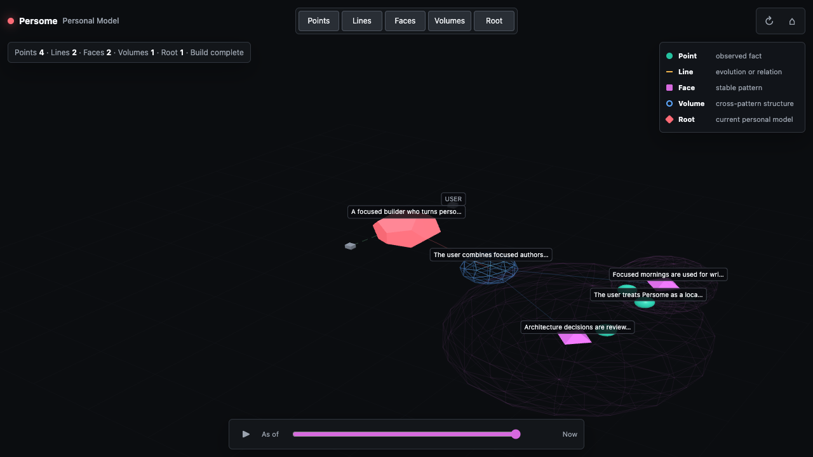
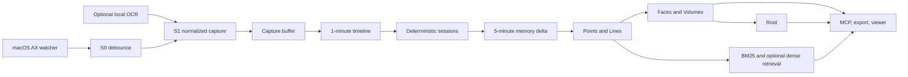

# Persome

**The local-first Personal Model Runtime for macOS.** Persome observes the apps
you already use, turns cross-app activity into an inspectable model of a real
person, and serves that model to MCP agents.

[](https://github.com/Intuition-Lab/personal-model/actions/workflows/ci.yml)
[](https://github.com/Intuition-Lab/personal-model/releases)
[](LICENSE)
[](#platform-support)
[](MCP.md)

**[Star Persome on GitHub](https://github.com/Intuition-Lab/personal-model)** to
follow the Runtime and help prioritize the next MCP integrations.



_Actual `/model` screenshot produced by `scripts/sample_demo.py --showcase`: 424
synthetic Points, 146 Lines, 12 Faces, 4 Volumes, and 1 Root. It contains no
personal data._

## Product job

Persome runs quietly on one Mac and does four jobs:

1. **Collect** focused macOS Accessibility (AX) context across apps, with an
   optional on-device OCR fallback for AX-poor surfaces.
2. **Model** observations into sourced facts, evolving relations, stable
   patterns, cross-domain structure, and one current Root.
3. **Serve** local memory and model tools over MCP.
4. **Give control back** through receipts, time travel, correction, export, and
   deletion.

This is the Runtime, not a hosted account or a single assistant's private
memory. One local model can be used by Claude Code, Codex, Cursor, or another
trusted MCP client.

## Five-minute sample demo

See the whole model without an API key, Accessibility permission, or access to
your real `~/.persome` data. This path requires Git and
[`uv`](https://docs.astral.sh/uv/getting-started/installation/):

```bash
git clone https://github.com/Intuition-Lab/personal-model.git
cd personal-model
uv run python scripts/sample_demo.py
```

Add `--showcase` to render the denser, still fully synthetic model used in the
README image.

The script opens `http://127.0.0.1:8743/model`, serves MCP at
`http://127.0.0.1:8743/mcp`, and deletes its temporary synthetic data when you
press `Ctrl-C`. To inspect the exact search, receipt, and snapshot payloads:

```bash
PERSOME_LLM_MOCK=1 uv run python scripts/sample_demo.py --json
```

With the sample server still running, verify the actual MCP transport from a
second terminal:

```bash
uv run python scripts/verify_sample_mcp.py
```

This sample path is deliberately separate from the real-data path below.

## Quick start with your data

Requirements: macOS 13 or newer, Xcode Command Line Tools, and a Python build
with SQLite 3.42+ (the installer verifies the secure FTS capability). The installer
finds or installs `uv`, provisions Python 3.11-3.13, compiles the Swift AX
helpers, generates the local screenshot-encryption key, enables and verifies
local OCR, and offers to register detected MCP clients. Before it reports
success, a native onboarding flow explains and requests Accessibility and
Screen Recording separately, starts Persome, checks local health, and writes a
fresh capture. Its fallback `uv` download is version-pinned and checked
against repository-pinned SHA-256 digests; the Runtime environment is installed
from the committed `uv.lock`, and the complete build-backend closure is
hash-constrained rather than resolved afresh.

```bash
git clone https://github.com/Intuition-Lab/personal-model.git
cd personal-model
bash install.sh

persome doctor
persome onboard
persome ocr status --check
persome model open
```

`persome onboard` is the repeatable recovery path. It shows one plain-language
macOS dialog before each system permission request and does not complete until
**Accessibility** and **Screen Recording** are granted. It then verifies the
isolated OCR worker, leaves the daemon running, polls `GET /health`, and forces
one fresh capture. OCR supplies text for AX-poor apps such as WeChat and Feishu;
pixels never enter an LLM prompt. Persome does not require Full Disk Access.

### Update an existing installation

Run the updater from any directory; no Git checkout is required:

```bash
persome update
```

The command downloads a fresh shallow checkout of the official `main` branch,
stops the old Runtime, runs the locked installer in update mode, preserves
`~/.persome` configuration, credentials, and personal data, then repeats the
permission/OCR/health/fresh-capture onboarding proof. It does not modify a
developer checkout. To test or install an already-reviewed local tree instead:

```bash
persome update --source /path/to/personal-model
```

```bash
# Recheck or repair OCR onboarding; disable is always explicit and reversible.
persome onboard
persome ocr setup
persome ocr status --check
persome ocr disable
```

An LLM is optional for collection and BM25 recall, but required for semantic
modeling. During installation, the provider wizard asks you to choose a service
and enter its API key. Persome supplies that provider's endpoint and default
model, tests completion and tool calling, and only then saves the route. Existing
keys are detected automatically. API keys go to the owner-only
`~/.persome/env` file under the provider-neutral `PERSOME_LLM_API_KEY` name;
provider-specific environment variables are import sources only. The non-secret
route goes to `~/.persome/config.toml`. Nothing ships with a key.

```bash
# If provider setup was skipped during installation:
persome llm providers
persome llm setup
persome llm status --check

# Restart after changing the active provider:
persome stop || true
persome start
```

Persome speaks two wire protocols: native Anthropic Messages and
OpenAI-compatible Chat Completions. Presets cover Anthropic, OpenAI, DeepSeek,
OpenRouter, Gemini, Groq, Mistral, xAI, Qwen, Moonshot/Kimi, Zhipu GLM,
SiliconFlow, Together, Fireworks, Cerebras, Azure OpenAI, Ollama, LM Studio, and
vLLM. `custom-openai` and `custom-anthropic` accept another compatible endpoint.
Azure and custom endpoints use a clearly marked advanced setup path. A preset
means the route is configured, not that every model has the necessary
capabilities; Persome warns when the default model cannot call tools.

Active work is reduced every five minutes by default. A first useful recall is
therefore expected within ten minutes of valid capture plus a working semantic
provider; `persome status`, `persome model status`, and the viewer explain sparse
or degraded states instead of inventing geometry.

## Proof points

### Local-first

- Durable Markdown, SQLite/FTS5, model snapshots, and logs live under
  `~/.persome` unless `PERSOME_ROOT` is set.
- AX is the default signal. Optional PP-OCRv6 runs locally in an isolated
  subprocess with bundled weights.
- The HTTP/MCP server is restricted to loopback (`127.0.0.1` by default), requires an owner-local
  bearer on API/MCP routes (or its one-use derived viewer capability), and emits no telemetry.
- Only configured semantic stages send derived text to the selected provider's
  LLM or embedding endpoint.

### Cross-app

The Swift watcher reads the focused AX tree across native and browser apps.
Persome normalizes focused element, visible text, window, application, URL, and
time into one capture and session pipeline. OCR is a fallback, not a parallel
cloud recorder.

### Agent-ready

- Authenticated streamable HTTP MCP: `http://127.0.0.1:8742/mcp`
- stdio MCP: `persome mcp`
- Stable model contract: `persome model export` and `GET /model/graph`
- Evidence tools: `search`, `read_receipt`, `verify_fact`, and
  `get_model_snapshot`

## Connect an MCP client

Register an owner-local stdio server. These clients launch it on demand, so the
daemon does not need to be running and no bearer is copied into their config:

```bash
persome install claude-code
persome install codex
persome install claude-desktop
persome install opencode

# Generate a stdio config that can be merged into Cursor's MCP config:
persome install mcp-json --filename persome-mcp.json
```

| Client | Verified configuration | Check |
|---|---|---|
| Claude Code | `persome install claude-code` | `claude mcp list` |
| Codex CLI / IDE | `persome install codex` | `codex mcp list` |
| Claude Desktop | `persome install claude-desktop` | fully quit and reopen the app |
| opencode | `persome install opencode` | `opencode mcp list` |
| Cursor | merge the generated `mcpServers.persome` object into `.cursor/mcp.json` or `~/.cursor/mcp.json` | Cursor Settings -> MCP |

The canonical JSON shape is:

```json
{
  "mcpServers": {
    "persome": {
      "command": "persome",
      "args": ["mcp"]
    }
  }
}
```

See [MCP client setup and verification](docs/mcp-clients.md) for authenticated
HTTP configs, uninstall commands, and privacy boundaries.

## Real MCP query with a cited answer

The following result is generated by the committed synthetic sample through the
same `search` and `read_receipt` implementation exposed by MCP.

```text
Tool: search
Input: {"query":"When does the user prefer focused writing?","top_k":2}

Top result:
  id:        20260701-0800-d4e5f6
  path:      project-work.md
  timestamp: 2026-07-01T08:00
  content:   The user reserves mornings for focused writing and review.

Tool: read_receipt
Input: {"entry_id":"20260701-0800-d4e5f6"}
```

A grounded client response can then say:

> The user prefers mornings for focused writing and review.
> [project-work.md, 2026-07-01 08:00;
> receipt `20260701-0800-d4e5f6`]

The receipt is resolvable, the superseded earlier statement remains available
as history, and the answer does not rely on the model's unsupported memory.

## Benchmark and verification status

This repository reports Runtime engineering evidence, not a paper-quality
personalization benchmark.

| Gate | Public evidence | Current status |
|---|---|---|
| Fresh root -> complete geometry | `tests/test_runtime_model_e2e.py` | deterministic synthetic pass |
| MCP search -> receipt | `sample_demo.py` + `verify_sample_mcp.py` | real streamable HTTP MCP, deterministic synthetic pass |
| Offline Runtime behavior | `pytest -m "not macos and not integration"` | complete offline suite; no provider key |
| Package completeness | clean wheel install + bundled Swift, Three.js, and PP-OCRv6 checks | required by CI/release |
| Release provenance | SHA-256 manifest + GitHub artifact attestations from a tag reachable from `main` | required by release workflow |
| Secret and personal-data safety | `secret_scan.py` + `pii_scan.py` | required by CI/release |
| Memory quality / next-action prediction | separate benchmark repository | **not reported here** |

The sample uses synthetic fixtures and cannot establish recall quality on a
real person. No cross-user benchmark, next-action accuracy, latency percentile,
or comparison win is claimed. The launch machine's three isolated source
installs had an 11.896-second median with a warm `uv` cache; conditions and
limitations are recorded in [benchmark scope](docs/benchmarks.md).

## Why Persome

These projects solve adjacent but different jobs:

| System | Primary job | Where Persome differs |
|---|---|---|
| [screenpipe](https://github.com/screenpipe/screenpipe) | searchable local screen/audio history and developer platform | Persome centers an evolving Point/Line/Face/Volume/Root personal model with correction and receipts for MCP agents. |
| [Mem0](https://github.com/mem0ai/mem0) | a memory layer populated by application or conversation events | Persome begins with ambient macOS work context, owns the local capture/session pipeline, and exposes an inspectable model rather than only a memory API. |
| Assistant/platform memory | convenience inside one provider or client | Persome is a local Runtime shared across trusted MCP clients; data, export, correction, and deletion remain under the user's control. |

Persome is not a replacement for a full screen archive, a hosted vector memory,
or a provider's preference feature. Choose it when the core requirement is a
local, cross-app, auditable model that multiple agents can query.

## How it works



Every modeled object keeps source receipts and bitemporal history. A sparse
store can truthfully contain Points and Lines without a Face, Volume, or Root.
The viewer shows that incomplete state rather than fabricating one.

Read [Runtime architecture](ARCHITECTURE.md), the
[model contract](MODEL_FORMAT.md), and the detailed
[maintainer architecture](docs/architecture.md).

## Inspect, correct, export, and delete

```bash
# Inspect
persome status
persome model status
persome faces-report
persome contradictions
persome model open

# Correct or revoke one memory while retaining its audit trail
persome correct --help
# Agents can also call MCP correct_memory.

# Export a redacted owner-only snapshot (0600)
persome model export

# Delete model memory, or all captures/timeline/model state
persome stop
persome clean memory
persome clean all
```

For a complete uninstall that preserves personal data by default:

```bash
bash uninstall.sh

# Explicitly remove the remaining data, config, env, exports, and logs:
bash uninstall.sh --delete-data --yes
```

Client registrations are removed separately and idempotently:

```bash
persome uninstall claude-code
persome uninstall codex
persome uninstall claude-desktop
persome uninstall opencode
```

See [operations and data control](docs/operations.md) for exact paths, backup
advice, export sensitivity, reset behavior, and manual removal steps.

## Privacy boundary

- Personal data remains local until a configured model stage or connected agent
  sends selected text to its own provider.
- MCP capture tools can return raw screen text, titles, URLs, and focused-field
  values. Bearer/stdio access is a personal-data capability; connect only
  clients you trust.
- Screenshots are omitted from MCP by default and encrypted at rest when
  retention is enabled.
- `persome model export` is redacted by default; `--raw` is an explicit opt-out.
- There is no built-in remote account, sync service, telemetry, meeting audio
  capture, computer-use actuation, or filesystem profiler.

Read [Security and privacy](SECURITY_PRIVACY.md) before using real personal
data, and report vulnerabilities through [SECURITY.md](SECURITY.md).

## Platform support

| Platform | Capture | Local OCR | Runtime / MCP |
|---|---|---|---|
| macOS 13+ on Apple Silicon (`arm64`) | supported | bundled PP-OCRv6 | supported |
| macOS 13+ on Intel (`x86_64`) | supported AX path | unavailable because Paddle does not ship the required Intel wheel | supported |
| Linux | no live macOS capture | not packaged | offline tests and development only |
| Windows | unsupported | unsupported | unsupported |

Python 3.11-3.13 with SQLite 3.42+ is supported by the installer. See
[operations](docs/operations.md) and [troubleshooting](docs/troubleshooting.md).

## Persome and Personome

**Persome** is this open-source Runtime and project name. **Personome** is the
research term for the learned model of one person: a dynamic state assembled
from sourced observations, relations, stable patterns, and higher-level
structure. The product name stays Persome in commands, packages, paths, APIs,
and documentation.

## Paper and architecture-note status

This repository ships the executable Runtime and an implementation-oriented
architecture note. The architecture documents are not a peer-reviewed paper,
and the Runtime's synthetic gates are not publication benchmarks. The paper,
benchmark suite, data statements, and project publication will live as separate
artifacts with independent licenses before release. See
[licensing boundaries](LICENSES.md) and [benchmark limitations](docs/benchmarks.md).

## Roadmap

The public roadmap is issue-driven:

- more tested MCP client integrations;
- richer first-run permission diagnostics;
- explicit import/export interoperability;
- Intel and future-macOS compatibility evidence;
- a separate, reproducible personal-model benchmark suite.

Browse [starter issues](https://github.com/Intuition-Lab/personal-model/issues) or
start a design question in
[Discussions](https://github.com/Intuition-Lab/personal-model/discussions).

## Contributing and community

Read [CONTRIBUTING.md](CONTRIBUTING.md), follow the
[Code of Conduct](CODE_OF_CONDUCT.md), and use [SUPPORT.md](SUPPORT.md) to choose
the right channel. Every commit requires DCO sign-off, and CI blocks known
secrets, personal data, non-English source text, contract drift, lint failures,
and offline regressions. Third-party Actions are pinned to reviewed commit SHAs
and workflow permissions default to read-only.

### Support Persome

If an inspectable, user-owned personal model is useful to your agents,
**[star Persome on GitHub](https://github.com/Intuition-Lab/personal-model)** and
share the MCP client or workflow you want supported in
[Discussions](https://github.com/Intuition-Lab/personal-model/discussions).

## License

Runtime code is Apache-2.0. Paper, benchmark, project-note, third-party, and
personal-data boundaries are explained in [LICENSES.md](LICENSES.md). Required
incorporated-work notices remain in [NOTICE](NOTICE) and
[THIRD_PARTY_NOTICES](THIRD_PARTY_NOTICES).
