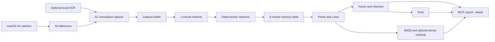

# Persome: Build your Personal Model

<!-- mcp-name: io.github.Intuition-Lab/personal-model -->

Persome is the local-first Personal Model Runtime for macOS. It observes focused
context across the apps you already use, turns that activity into an
inspectable, evidence-linked model, and serves it to Claude Code, Codex, Cursor,
and other trusted MCP clients.

Think of it as a living, evidence-backed HUMAN.md rather than a static profile:
claims keep receipts, history stays inspectable, and corrections remain
auditable.

**Runs locally on your Mac. Private by default. Yours to inspect, correct,
export, and delete.**

[](https://github.com/Intuition-Lab/personal-model/actions/workflows/ci.yml)
[](https://github.com/Intuition-Lab/personal-model/releases)
[](LICENSE)
[](#platform-support)
[](MCP.md)
[](https://registry.modelcontextprotocol.io/?q=Persome)

**[Try the synthetic demo](#1-five-minute-synthetic-demo)** ·
**[Install with your data](#2-install-with-your-data)** ·
**[Connect an MCP client](#3-connect-a-trusted-mcp-client)** ·
**[Star Persome on GitHub](https://github.com/Intuition-Lab/personal-model)**


_Actual `/model` screenshot produced by `scripts/sample_demo.py --showcase`: 424
synthetic Points, 146 Lines, 12 Faces, 4 Volumes, and 1 Root. It contains no
personal data._

## What Persome does

Persome runs quietly on one Mac and does four jobs:

1. **Collect** focused macOS Accessibility (AX) context across apps, with an
   optional on-device OCR fallback for AX-poor surfaces.
2. **Model** observations into sourced facts, evolving relations, stable
   patterns, cross-domain structure, and, when evidence supports it, at most one
   current Root.
3. **Serve** local memory and model tools over MCP.
4. **Give control back** through receipts, time travel, correction, export, and
   deletion.

This is the Runtime, not a hosted account or one assistant's private memory.
One local model can be shared by the trusted MCP clients you choose.

## One Root — an evolving model of you

Persome connects activity into progressively deeper context:

| Layer | Meaning |
|---|---|
| **Point** | A sourced observation, fact, or historical state |
| **Line** | A relationship, change, or supersession over time |
| **Face** | A stable pattern supported by related evidence |
| **Volume** | Higher-order structure across projects or areas of life |
| **Root** | At most one current, integrated view of the person |

Higher layers are earned by evidence, not guaranteed by elapsed time. A sparse
model may contain only Points and Lines; Persome shows missing geometry as
degraded instead of fabricating a Face, Volume, or Root. Every important claim
keeps receipts, and new evidence can strengthen, revise, or overturn an earlier
inference.

## Same AI. Your context.

Two people can ask the same assistant the same question and reasonably need
different answers. Persome gives a connected agent source-linked context about
the person it is working for without hiding where that context came from.

- **Continue where you left off.** Search recent work and decisions, inspect
  receipts, and look for evidence of unfinished work.
- **One model, trusted clients.** Let Claude Code, Codex, Cursor, and other
  trusted MCP clients query the same local model.
- **Stay in control.** Inspect, correct, export, or delete the model. Persome
  itself does not act; external action remains with the connected client and
  your policy.

## Install, connect, and verify

Choose the path that matches what you want to prove. The synthetic demo and the
real-data install are intentionally separate.

### 1. Five-minute synthetic demo

See the whole model without an API key, macOS Accessibility permission, or
access to your real `~/.persome` data. This path requires Git and
[`uv`](https://docs.astral.sh/uv/getting-started/installation/):

```bash
git clone https://github.com/Intuition-Lab/personal-model.git
cd personal-model
uv run python scripts/sample_demo.py
```

Add `--showcase` to render the denser, still fully synthetic model used in the
README image.

The script opens `http://127.0.0.1:8743/model`, serves MCP at
`http://127.0.0.1:8743/mcp`, and deletes its temporary synthetic data when you
press `Ctrl-C`. To inspect the exact search, receipt, and snapshot payloads:

```bash
PERSOME_LLM_MOCK=1 uv run python scripts/sample_demo.py --json
```

With the sample server still running, verify the actual MCP transport from a
second terminal:

```bash
uv run python scripts/verify_sample_mcp.py
```

This sample path is deliberately separate from the real-data path below.

### 2. Install with your data

Requirements: macOS 13 or newer and Xcode Command Line Tools. For the shortest
package-managed installation, install the published PyPI distribution with
[`uv`](https://docs.astral.sh/uv/getting-started/installation/) and run the
explicit onboarding proof:

```bash
uv tool install personal-model
persome onboard
persome model open --after 30
```

The distribution is named `personal-model`; the installed CLI remains
`persome`.

For the most explicit source-based first run:

```bash
git clone https://github.com/Intuition-Lab/personal-model.git
cd personal-model
bash install.sh
```

After successful interactive onboarding, the source installer schedules the
one-shot 30-minute viewer reminder automatically.

#### What onboarding proves

- `persome onboard` explains each macOS request before it appears.
- Accessibility is granted to the versioned `mac-ax-helper` and, only when
  event-driven capture is enabled, `mac-ax-watcher`.
- Screen Recording is requested only when the effective screenshot or local-OCR
  policy requires pixels. Persome never requires Full Disk Access.
- On Apple Silicon, onboarding verifies the isolated local OCR worker when OCR
  is enabled.
- It proves the final lifecycle owner and Runtime generation, then reports a
  fresh-capture receipt in standard daemon mode or an explicit readiness/privacy
  receipt for supported alternate modes such as trusted ingest.

An LLM is optional for collection and BM25 recall, but required for semantic
modeling. If provider setup was skipped, run:

```bash
persome llm setup
persome llm status --check
```

Provider keys live in the owner-only `~/.persome/env`; non-secret routing lives
in `~/.persome/config.toml`. Nothing ships with a key. See
[configuration](docs/config.md) for provider presets, local endpoints, and OCR
policy.

### 3. Connect a trusted MCP client

Persome is verified in the
[Official MCP Registry](https://registry.modelcontextprotocol.io/?q=Persome) as
`io.github.Intuition-Lab/personal-model`. Register whichever owner-local clients
you use:

```bash
persome install claude-code
persome install codex
persome install claude-desktop
persome install opencode
```

These stdio registrations launch Persome on demand, so the daemon does not need
to be running and no HTTP bearer is copied into client configuration.

For Cursor, generate a stdio configuration and merge its
`mcpServers.persome` object into `.cursor/mcp.json` or `~/.cursor/mcp.json`:

```bash
persome install mcp-json --filename persome-mcp.json
```

| Client | Check |
|---|---|
| Claude Code | `claude mcp list` |
| Codex CLI / IDE | `codex mcp list` |
| Claude Desktop | fully quit and reopen the app |
| opencode | `opencode mcp list` |
| Cursor | Cursor Settings -> MCP |

> MCP access is a personal-data capability; register only clients you trust.

See [MCP client setup and verification](docs/mcp-clients.md) for authenticated
HTTP configs, uninstall commands, and the canonical JSON shape. Registry hosts
can use the published entry described in [MCP.md](MCP.md).

### 4. Verify and ask grounded questions

```bash
persome status
persome model status
persome model open

# Only if you configured a semantic provider:
persome llm status --check
```

A sparse or degraded model can be valid early; Persome reports missing geometry
instead of fabricating Faces, Volumes, or a Root.

After connecting an MCP client, try:

> Search my Persome memory for **[topic]**. Use `search`, open the strongest
> result with `read_receipt`, and cite the source path, timestamp, and receipt
> ID. If the evidence is missing or conflicting, say so instead of guessing.

Active work is reduced every five minutes by default. With valid capture and a
working semantic provider, a first useful recall is operationally expected
within about ten minutes, not guaranteed as a benchmark result.

### 5. Update Persome

For a `uv tool` installation, upgrade with the package manager and re-run
Runtime proof:

```bash
uv tool upgrade personal-model
persome onboard
persome model open --after 30
```

For an installation created by `install.sh`, run the transactional updater from
any directory:

```bash
persome update
```

`persome update` preserves configuration, credentials, personal data, capture
policy, and lifecycle intent, and performs its own mode-aware onboarding before
committing the update. Do not use it to update a package-manager-managed
installation. See [operations and data control](docs/operations.md) for rollback,
OCR repair, backup, and uninstall details.

## Runtime proof points

### Local-first

- Durable Markdown, SQLite/FTS5, model snapshots, and logs live under
  `~/.persome` unless `PERSOME_ROOT` is set.
- AX is the default signal. Optional PP-OCRv6 runs locally in an isolated
  subprocess with bundled weights.
- The HTTP/MCP server is restricted to loopback (`127.0.0.1` by default), requires an owner-local
  bearer on API/MCP routes (or its one-use derived viewer capability), and emits no telemetry.
- Only configured semantic stages send derived text to the selected provider's
  LLM or embedding endpoint.

### Cross-app

The source-versioned Swift watcher notices AX events and the matching helper
reads the focused AX tree across native and browser apps. Persome normalizes
focused element, visible text, window, application, URL, and time into one
capture and session pipeline. OCR is a fallback, not a parallel cloud recorder.

### Agent-ready

- Authenticated streamable HTTP MCP: `http://127.0.0.1:8742/mcp`
- stdio MCP: `persome mcp`
- Stable model contract: `persome model export` and `GET /model/graph`
- Evidence tools: `search`, `read_receipt`, `resolve_evidence`, `verify_fact`,
  and `get_model_snapshot`

## Real MCP query with a cited answer

The following result is generated by the committed synthetic sample through the
same `search` and `read_receipt` implementation exposed by MCP.

```text
Tool: search
Input: {"query":"When does the user prefer focused writing?","top_k":2}

Top result:
  id:        20260701-0800-d4e5f6
  path:      project-work.md
  timestamp: 2026-07-01T08:00
  content:   The user reserves mornings for focused writing and review.

Tool: read_receipt
Input: {"entry_id":"20260701-0800-d4e5f6"}
```

A grounded client response can then say:

> The user prefers mornings for focused writing and review.
> [project-work.md, 2026-07-01 08:00;
> receipt `20260701-0800-d4e5f6`]

The receipt is resolvable, the superseded earlier statement remains available
as history, and the answer does not rely on the model's unsupported memory.

## Benchmark and verification status

This repository reports Runtime engineering evidence, not a paper-quality
personalization benchmark.

| Gate | Public evidence | Current status |
|---|---|---|
| Fresh root -> complete geometry | `tests/test_runtime_model_e2e.py` | deterministic synthetic pass |
| MCP search -> receipt | `sample_demo.py` + `verify_sample_mcp.py` | real streamable HTTP MCP, deterministic synthetic pass |
| Offline Runtime behavior | `pytest -m "not macos and not integration"` | complete offline suite; no provider key |
| Package completeness | clean wheel install + bundled Swift, Three.js, and PP-OCRv6 checks | required by CI/release |
| Release provenance | SHA-256 manifest + GitHub artifact attestations from a tag reachable from `main` | required by release workflow |
| Secret and personal-data safety | `secret_scan.py` + `pii_scan.py` | required by CI/release |
| Memory quality / next-action prediction | separate benchmark repository | **not reported here** |

The sample uses synthetic fixtures and cannot establish recall quality on a
real person. No cross-user benchmark, next-action accuracy, latency percentile,
or comparison win is claimed. The launch machine's three isolated source
installs had an 11.896-second median with a warm `uv` cache; conditions and
limitations are recorded in [benchmark scope](docs/benchmarks.md).

## Where Persome fits

These projects solve adjacent but different jobs:

| System | Primary job | Where Persome differs |
|---|---|---|
| [screenpipe](https://github.com/screenpipe/screenpipe) | searchable local screen/audio history and developer platform | Persome centers an evolving Point/Line/Face/Volume/Root personal model with correction and receipts for MCP agents. |
| [Mem0](https://github.com/mem0ai/mem0) | a memory layer populated by application or conversation events | Persome begins with ambient macOS work context, owns the local capture/session pipeline, and exposes an inspectable model rather than only a memory API. |
| Assistant/platform memory | convenience inside one provider or client | Persome is a local Runtime shared across trusted MCP clients; data, export, correction, and deletion remain under the user's control. |

Persome is not a replacement for a full screen archive, a hosted vector memory,
or a provider's preference feature. Choose it when the core requirement is a
local, cross-app, auditable model that multiple agents can query.

## How it works



Every modeled object keeps source receipts and bitemporal history. A sparse
store can truthfully contain Points and Lines without a Face, Volume, or Root.
The viewer shows that incomplete state rather than fabricating one.

## Read the docs

| Need | Start here |
|---|---|
| Installation and Runtime verification | [VALIDATION.md](VALIDATION.md) |
| Runtime architecture | [ARCHITECTURE.md](ARCHITECTURE.md) |
| Model format and snapshot contract | [MODEL_FORMAT.md](MODEL_FORMAT.md), [model contract](docs/model-contract.md) |
| MCP tools and client setup | [MCP.md](MCP.md), [client setup](docs/mcp-clients.md) |
| Configuration and LLM providers | [configuration](docs/config.md) |
| Operations and troubleshooting | [operations](docs/operations.md), [troubleshooting](docs/troubleshooting.md) |
| Security and privacy | [SECURITY_PRIVACY.md](SECURITY_PRIVACY.md) |

## Inspect, correct, export, and delete

```bash
# Inspect
persome status
persome model status
persome faces-report
persome contradictions
persome model open

# Correct or revoke one memory while retaining its audit trail
persome correct --help
# Agents can also call MCP correct_memory.

# Export a redacted owner-only snapshot (0600)
persome model export

# Delete model memory, or all captures/timeline/model state
persome stop
persome clean memory
persome clean all
```

For a complete uninstall that preserves personal data by default:

```bash
bash uninstall.sh

# Explicitly remove the remaining data, config, env, exports, and logs:
bash uninstall.sh --delete-data --yes
```

Client registrations are removed separately and idempotently:

```bash
persome uninstall claude-code
persome uninstall codex
persome uninstall claude-desktop
persome uninstall opencode
```

See [operations and data control](docs/operations.md) for exact paths, backup
advice, export sensitivity, reset behavior, and manual removal steps.

## Privacy boundary

- Personal data remains local until a configured model stage or connected agent
  sends selected text to its own provider.
- MCP capture tools can return raw screen text, titles, URLs, and focused-field
  values. Bearer/stdio access is a personal-data capability; connect only
  clients you trust.
- Screenshots are omitted from MCP by default and encrypted at rest when
  retention is enabled.
- `persome model export` is redacted by default; `--raw` is an explicit opt-out.
- There is no built-in remote account, sync service, telemetry, meeting audio
  capture, computer-use actuation, or filesystem profiler.

Read [Security and privacy](SECURITY_PRIVACY.md) before using real personal
data, and report vulnerabilities through [SECURITY.md](SECURITY.md).

## Platform support

| Platform | Capture | Local OCR | Runtime / MCP |
|---|---|---|---|
| macOS 13+ on Apple Silicon (`arm64`) | supported | bundled PP-OCRv6 | supported |
| macOS 13+ on Intel (`x86_64`) | supported AX path | unavailable because Paddle does not ship the required Intel wheel | supported |
| Linux | no live macOS capture | not packaged | offline tests and development only |
| Windows | unsupported | unsupported | unsupported |

Python 3.11-3.13 with SQLite 3.42+ is supported by the installer. See
[operations](docs/operations.md) and [troubleshooting](docs/troubleshooting.md).

## Persome and Personome

**Persome** is this open-source Runtime and project name. **Personome** is the
research term for the learned model of one person: a dynamic state assembled
from sourced observations, relations, stable patterns, and higher-level
structure. The product name stays Persome in commands, packages, paths, APIs,
and documentation.

## Paper and architecture-note status

This repository ships the executable Runtime and an implementation-oriented
architecture note. The architecture documents are not a peer-reviewed paper,
and the Runtime's synthetic gates are not publication benchmarks. The paper,
benchmark suite, data statements, and project publication will live as separate
artifacts with independent licenses before release. See
[licensing boundaries](LICENSES.md) and [benchmark limitations](docs/benchmarks.md).

## Roadmap

The public roadmap is issue-driven:

- more tested MCP client integrations;
- richer first-run permission diagnostics;
- explicit import/export interoperability;
- Intel and future-macOS compatibility evidence;
- a separate, reproducible personal-model benchmark suite.

Browse [starter issues](https://github.com/Intuition-Lab/personal-model/issues) or
start a design question in
[Discussions](https://github.com/Intuition-Lab/personal-model/discussions).

## Contributing and community

Read [CONTRIBUTING.md](CONTRIBUTING.md), follow the
[Code of Conduct](CODE_OF_CONDUCT.md), and use [SUPPORT.md](SUPPORT.md) to choose
the right channel. Every commit requires DCO sign-off, and CI blocks known
secrets, personal data, non-English source text, contract drift, lint failures,
and offline regressions. Third-party Actions are pinned to reviewed commit SHAs
and workflow permissions default to read-only.

## Contributors

Persome is shaped by people across engineering, design, research, and community.

<!-- ALL-CONTRIBUTORS-LIST:START - Do not remove or modify this section -->
<table>
  <tbody>
    <tr>
      <td valign="middle">
        <a href="https://github.com/Singularity-tian"></a>
        &nbsp;&nbsp;<strong><a href="https://github.com/Singularity-tian">Singularity</a></strong><br />
        &nbsp;&nbsp;<sub>💻&nbsp;Code</sub>
      </td>
      <td valign="middle">
        <a href="https://github.com/GouBuliya"></a>
        &nbsp;&nbsp;<strong><a href="https://github.com/GouBuliya">Li_Xufeng</a></strong><br />
        &nbsp;&nbsp;<sub>💻&nbsp;Code</sub>
      </td>
      <td valign="middle">
        <a href="https://github.com/SiyiZhu1"></a>
        &nbsp;&nbsp;<strong><a href="https://github.com/SiyiZhu1">Siyi</a></strong><br />
        &nbsp;&nbsp;<sub>🎨&nbsp;Design</sub>
      </td>
    </tr>
    <tr>
      <td valign="middle">
        <a href="https://github.com/kevinaimonster"></a>
        &nbsp;&nbsp;<strong><a href="https://github.com/kevinaimonster">Kevin</a></strong><br />
        &nbsp;&nbsp;<sub>💻&nbsp;Code</sub>
      </td>
      <td valign="middle">
        <a href="https://github.com/huachenjie238-oss"></a>
        &nbsp;&nbsp;<strong><a href="https://github.com/huachenjie238-oss">huachenjie238-oss</a></strong><br />
        &nbsp;&nbsp;<sub>📈&nbsp;Growth</sub>
      </td>
      <td valign="middle">
        <a href="https://github.com/JingYangGit"></a>
        &nbsp;&nbsp;<strong><a href="https://github.com/JingYangGit">Jing@Meowy</a></strong><br />
        &nbsp;&nbsp;<sub>📈&nbsp;Growth</sub>
      </td>
    </tr>
    <tr>
      <td valign="middle">
        <a href="https://github.com/AMTso7aw"></a>
        &nbsp;&nbsp;<strong><a href="https://github.com/AMTso7aw">Zhiheng Chen</a></strong><br />
        &nbsp;&nbsp;<sub>💻&nbsp;Code</sub>
      </td>
    </tr>
  </tbody>
</table>
<!-- ALL-CONTRIBUTORS-LIST:END -->

<sub>Contribution labels follow the
[All Contributors](https://allcontributors.org/docs/en/emoji-key) convention.
Contributions of every kind are welcome.</sub>

### Support Persome

If an inspectable, user-owned personal model is useful to your agents,
**[star Persome on GitHub](https://github.com/Intuition-Lab/personal-model)** and
share the MCP client or workflow you want supported in
[Discussions](https://github.com/Intuition-Lab/personal-model/discussions).

## License

Runtime code is Apache-2.0. Paper, benchmark, project-note, third-party, and
personal-data boundaries are explained in [LICENSES.md](LICENSES.md). Required
incorporated-work notices remain in [NOTICE](NOTICE) and
[THIRD_PARTY_NOTICES](THIRD_PARTY_NOTICES).
