# Runtime architecture

Persome is one local daemon with one production ingestion path. It observes a
person, forms bounded state, updates an auditable personal model, and exposes
that model to local consumers. There is no product workflow or predictor hidden
beside this path.

## End-to-end path

```mermaid
flowchart LR
    AX["macOS AX watcher"] --> S0["S0 debounce and dedup"]
    ING["trusted local ingest"] --> S1
    S0 --> S1["S1 focused element, visible text, URL"]
    OCR["optional local OCR worker"] --> CAP
    S1 --> CAP[("capture buffer and captures FTS")]
    CAP --> TL["one-minute timeline normalizer"]
    TL --> BL[("timeline_blocks")]
    BL --> SES["three-rule session cutter"]
    SES --> RED["five-minute active reducer"]
    RED --> EVT[("event daily memory")]
    RED --> ACTIVE["active-window modeling"]
    ACTIVE --> DELTA["evidence-gated memory_delta"]
    SES -->|session end| FIN["trailing-window finalizer"]
    EVT --> FIN
    BL --> FIN
    FIN --> DELTA
    DELTA --> APPLY["deterministic Point and Line apply"]
    FIN --> PAT["repeated behavior memory"]
    APPLY --> EVO[("evomem, Markdown, FTS")]
    PAT --> EVO
    EVO --> BUILD["case, schema, cross-domain, Root, layout"]
    BUILD --> SNAP["versioned personal model"]
    SNAP --> MCP["MCP"]
    SNAP --> VIEW["localhost /model"]
```

### State formation

1. With `capture.source="daemon"`, the source-versioned Swift watcher emits AX
   events and `capture/event_dispatcher.py` performs event deduplication,
   debounce, and minimum-gap control. With `source="ingest"`, a trusted local
   producer owns OS capture and sends authenticated frames; the daemon starts no
   watcher. Both modes converge in the same scheduler/commit path.
2. `capture/scheduler.py` builds an S1 record. AX is primary in daemon mode. When explicitly
   enabled and AX text is poor, a focused screenshot is sent to an isolated
   local OCR subprocess; its text is backfilled into `captures` FTS.
3. `timeline/aggregator.py` consults both the capture JSON and OCR backfill,
   removes UI repetition, preserves authored evidence, and writes wall-clock
   aligned one-minute blocks.
4. `session/manager.py` cuts work using idle-gap, single-app soft-cut, and
   maximum-duration rules.
5. `writer/session_reducer.py` flushes active sessions every five minutes;
   `writer.agent.model_active_session` turns each new window into Points/Lines.
   Session end writes and models only the trailing range.

### Runtime readiness and ownership

The control path is generation-bound. `.daemon.lock` is acquired before start
preflight and inherited for the complete foreground or double-forked daemon
lifetime. The daemon publishes `.runtime-state.json` with `starting`/`ready`
phase, random generation, current permission probes, OCR policy/worker state,
and its last fresh-capture, ingest-readiness, paused, or locked receipt. HTTP
onboarding reads the same data through authenticated endpoints; HTTP-disabled
mode reads the owner-only file directly.

Lifecycle operations treat `.pid` as compatibility input, then verify user,
command/executable, process start time, and generation again before signaling.
LaunchAgent ownership additionally requires its loaded job program/PID and
configured plist to match the recorded Runtime; `.launchagent-owner` preserves
intent across updates. Ambiguous live state fails closed rather than starting a
second writer.

AX permissions are similarly bound to the actual principals. The immutable
`mac-ax-helper` and optional `mac-ax-watcher` each self-check/request
Accessibility. Their machine-local path is derived from architecture and Swift
source bytes, so same-version installs reuse the exact executable. Changed
helper source resolves a new path and requires a new explicit grant; rollback
resolves the old helper again. `[capture].ocr_policy` independently preserves
`auto`, explicit enabled, or explicit disabled intent across onboarding/update.

The updater holds a separate owner-only lock, builds a marked inactive
`venv.replacement.update`, and atomically exchanges it with `venv`. The old code
stays at the replacement path until the replacement's final background or
LaunchAgent owner passes the mode-aware readiness proof. Transaction phase and
candidate marker are fsynced, so recovery can tell whether exchange occurred
even if the process died before recording the next phase; rollback performs the
same atomic exchange in reverse.

### Incremental and terminal modeling

Every successful active flush enters `writer.agent.model_active_session` and
the windowed memory-delta path. Every reduced session then enters
`writer.agent.finalize_session`, regardless of
whether the terminal reducer wrote a new entry. This matters when prior flushes
already covered the whole session or when the reducer exhausted its LLM retries
and wrote a heuristic fallback.

The finalizer runs:

1. classifier compatibility/incremental catch-up;
2. repeated-pattern detection into `skills/skill-*.md`;
3. one structured `memory_delta` extraction over the unmodeled tail;
4. deterministic gates for quoted evidence, identity, predicate vocabulary,
   and confidence;
5. deterministic apply into current/historical Points and relation Lines.

Each memory-delta window is persisted before apply. `apply_status` allows a
crashed apply to resume without another LLM call. Point, assertion, event-edge,
semantic-relation, and closure writes in a persisted memory-delta payload are
naturally content-keyed, MAX-based, or monotone idempotent. Before either
additive attention-floor or co-occurrence
reinforcement, a durable delta/edge-generation receipt freezes its absolute
observation target; retry applies `MAX(target)` instead of another increment.
A crash after model mutations but before `apply_status=applied` is therefore
safe to resume. The first receipt binds the delta to that validity generation;
if a later delta closes and reopens the edge before retry, the old retry is a
safe no-op rather than counting its evidence in the new interval.
`delta_end` advances after successful active apply; the session receives
`modeled_at` only after all terminal stages finish. A kernel
`session-model.lock` coordinates daemon, retry, CLI, and model-build callers.
Reducer, classifier, pattern detector, and memory delta share one half-open
timeline selector: full wall blocks remain compact, boundary straddlers are
rebuilt from in-range raw captures, and occupied missing blocks stop every
watermark. Terminal off-minute work waits for the closed-minute barrier rather
than reading a whole block past the session cutoff.

### Higher geometry

New Point/Line evidence triggers a debounced build every 30 minutes by default;
`persome model build` and the unconditional 00:15 build call the same locked
coordinator:

1. recover pending reductions and terminal modeling;
2. initialize the evomem baseline when needed;
3. enrich entities, reusable problem/solution cases, and optional relation edges;
4. mine stable per-domain Faces;
5. synthesize repeated cross-domain Volumes;
6. synthesize at most one Root;
7. backfill vectors when an embeddings endpoint is configured;
8. generate semantic coordinates for `/model`.

Each stage records complete, skipped, or failed. Missing geometry or a failed
enabled substage makes the build `degraded`. The build never fabricates an
empty replacement for a previously valid Root.

Historical replay gives the coordinator an explicit `evidence_as_of` cutoff.
That cutoff flows through the pipeline and enrichment into reusable-case source
selection, where both sides of the lookback window are enforced. It is separate
from the processing wall clock: manifests, `modeled_at`, retries, and newly
created memory retain the time at which the build actually ran. Ordinary daemon
and CLI builds default the evidence cutoff to their current build-start time.

## Daemon tasks

The registry in `src/persome/daemon.py` is the authoritative task list.

| Task | Cadence and responsibility |
|---|---|
| `capture` | Continuous AX watcher or trusted ingest runner; writes deduplicated S1 captures and updates session activity. |
| `session` | Every `session.tick_seconds`; evaluates idle, soft-cut, and timeout boundaries. |
| `reducer-retry` | Every 60 seconds; consumes `next_retry_at`, then sends reduced or heuristic terminal results through the shared finalizer. |
| `daily-safety-net` | At 23:55 by default; force-ends the open session, catches all stranded reduction/modeling work, reprojects, snapshots, prunes telemetry, and runs enabled maintenance. |
| `wal-checkpoint` | Every 60 seconds; owns all scheduled WAL checkpoints (`TRUNCATE` after daemon start and at each local-day rollover, otherwise `PASSIVE`). Per-connection auto-checkpointing stays disabled. |
| `timeline` | Every 60 seconds; materializes closed timeline windows and applies capture retention. |
| `flush` | Every `session.flush_minutes`; reduces and models the new active-session window as Points/Lines. |
| `classifier-tick` | Legacy-only: every `classifier.interval_minutes` when delta apply is disabled. |
| `vector-embed-tick` | Every 60 seconds when hybrid retrieval is enabled; drains the embedding queue. It is a no-op without credentials. |
| `model-refresh` | Every `schema.refresh_minutes` when new Point/Line evidence exists; refreshes Face/Volume/Root. |
| `schema-tick` | At 00:15 by default; invokes the shared personal-model build. |
| `mcp` | Hosts streamable HTTP MCP, REST routes, and `/model`; restarts with backoff after a crash. |

`--capture-only` keeps `capture`, `session`, `reducer-retry`, the daily safety
net, and configured MCP. It disables timeline, flush, classifier, vectors, and
schema/model processing. It is a diagnostic/embedding mode, not a second
ingestion architecture.

## Storage

`src/persome/paths.py` owns every location. The default root is `~/.persome`.

| Artifact | Role |
|---|---|
| `capture-buffer/*.json` | Bounded raw S1 records and optional encrypted screenshots. |
| `memory/*.md` | Human-readable event, fact, schema, and correction history. |
| `memory/skills/skill-*.md` | Evidence-backed repeated behavior. |
| `index.db` | WAL-mode sessions, FTS5, evomem, relations, geometry, receipts, vectors, and audit tables. |
| `model-build.json` | Owner-only build conditions and stage outcomes. |
| `exports/*.json` | Owner-only, redacted-by-default snapshots. |
| `backup/*.db` | Verified daily SQLite snapshots when enabled. |

Markdown is the default write authority and evomem is its maintained shadow.
An operator may explicitly invert authority to evomem; this does not change the
public snapshot contract. SQLite access must use `with fts.cursor() as conn:` so
readers and writers coexist under WAL mode.

## Public access

- **CLI:** lifecycle, recovery, inspection, correction, and model build/export.
- **MCP:** memory/model reads, provenance drill-down, and explicit audited writes.
- **Viewer:** `persome model open` while the daemon HTTP server is active. It
  exchanges the owner bearer for a one-time browser capability, then reads
  `/model/graph` and packaged local Three.js assets.
- **Snapshot:** schema-versioned JSON for external clients and products.

The Runtime contains no click/type actuation, notification lifecycle, meeting
audio, or evaluation runner.

## Failure semantics

- No selected provider credential (unless using a keyless local endpoint):
  capture and BM25 remain available; semantic stages report
  skips/failures and model status stays degraded.
- OCR worker crash: the worker is restarted/fails open; the daemon survives.
- Reducer failure: persisted exponential retry; final exhaustion writes an
  auditable heuristic event, then still runs terminal modeling. Timeline
  readiness gaps defer without spending an LLM attempt.
- Active model failure: `delta_end` does not advance, so the next flush retries a larger window.
- Terminal model failure: `modeled_at` remains null and retry/recovery can
  resume. The minute loop handles only a newly eligible closing-block wait;
  generic stage failures wait for boot/daily/manual recovery.
- Model build overlap: `model-build.lock` waits or reports busy.
- Integrity/snapshot failure: structured error logs and optional write freeze;
  there is no removed SSE event bus.

See `capture.md`, `timeline.md`, `session.md`, and `writer.md` for stage details.
