# Runtime architecture

Persome is one local daemon with one production ingestion path. It observes a
person, forms bounded state, updates an auditable personal model, and exposes
that model to local consumers. There is no product workflow or predictor hidden
beside this path.

## End-to-end path

```mermaid
flowchart LR
    AX["macOS AX watcher"] --> S0["S0 debounce and dedup"]
    ING["trusted local ingest"] --> S1
    S0 --> S1["S1 focused element, visible text, URL"]
    OCR["optional local OCR worker"] --> CAP
    S1 --> CAP[("capture buffer and captures FTS")]
    CAP --> TL["one-minute timeline normalizer"]
    TL --> BL[("timeline_blocks")]
    BL --> SES["three-rule session cutter"]
    SES --> RED["incremental and terminal reducer"]
    RED --> EVT[("event daily memory")]
    EVT --> FIN["shared terminal finalizer"]
    BL --> FIN
    FIN --> DELTA["evidence-gated memory_delta"]
    DELTA --> APPLY["deterministic Point and Line apply"]
    FIN --> PAT["repeated behavior memory"]
    APPLY --> EVO[("evomem, Markdown, FTS")]
    PAT --> EVO
    EVO --> BUILD["case, schema, cross-domain, Root, layout"]
    BUILD --> SNAP["versioned personal model"]
    SNAP --> MCP["MCP"]
    SNAP --> CHAT["Chat"]
    SNAP --> VIEW["localhost /model"]
```

### State formation

1. The Swift watcher emits AX events. `capture/event_dispatcher.py` performs
   event deduplication, debounce, and minimum-gap control.
2. `capture/scheduler.py` builds an S1 record. AX is primary. When explicitly
   enabled and AX text is poor, a focused screenshot is sent to an isolated
   local OCR subprocess; its text is backfilled into `captures` FTS.
3. `timeline/aggregator.py` consults both the capture JSON and OCR backfill,
   removes UI repetition, preserves authored evidence, and writes wall-clock
   aligned one-minute blocks.
4. `session/manager.py` cuts work using idle-gap, single-app soft-cut, and
   maximum-duration rules.
5. `writer/session_reducer.py` periodically flushes long sessions and writes a
   terminal event record when a session ends.

### Terminal modeling

Every reduced session enters `writer.agent.finalize_session`, regardless of
whether the terminal reducer wrote a new entry. This matters when prior flushes
already covered the whole session or when the reducer exhausted its LLM retries
and wrote a heuristic fallback.

The finalizer runs:

1. classifier compatibility/incremental catch-up;
2. repeated-pattern detection into `skills/skill-*.md`;
3. one structured `memory_delta` extraction over the session;
4. deterministic gates for quoted evidence, identity, predicate vocabulary,
   and confidence;
5. deterministic apply into current/historical Points and relation Lines.

The memory-delta row is persisted before apply. `apply_status` allows a crashed
apply to resume without another LLM call or duplicate relation reinforcement.
The session receives `modeled_at` only after all enabled terminal stages finish.
A kernel `session-model.lock` coordinates daemon, retry, CLI, and model-build
callers.

### Higher geometry

`persome model build` and the scheduled 00:15 build call one locked coordinator:

1. recover pending reductions and terminal modeling;
2. initialize the evomem baseline when needed;
3. enrich entities, reusable problem/solution cases, and optional relation edges;
4. mine stable per-domain Faces;
5. synthesize repeated cross-domain Volumes;
6. synthesize at most one Root;
7. backfill vectors when an embeddings endpoint is configured;
8. generate semantic coordinates for `/model`.

Each stage records complete, skipped, or failed. Missing geometry or a failed
enabled substage makes the build `degraded`. The build never fabricates an
empty replacement for a previously valid Root.

## Daemon tasks

The registry in `src/persome/daemon.py` is the authoritative task list.

| Task | Cadence and responsibility |
|---|---|
| `capture` | Continuous AX watcher or trusted ingest runner; writes deduplicated S1 captures and updates session activity. |
| `session` | Every `session.tick_seconds`; evaluates idle, soft-cut, and timeout boundaries. |
| `reducer-retry` | Every 60 seconds; consumes `next_retry_at`, then sends reduced or heuristic terminal results through the shared finalizer. |
| `daily-safety-net` | At 23:55 by default; force-ends the open session, catches all stranded reduction/modeling work, reprojects, checkpoints, snapshots, prunes telemetry, and runs enabled maintenance. |
| `timeline` | Every 60 seconds; materializes closed timeline windows and applies capture retention. |
| `flush` | Every `session.flush_minutes`; incrementally reduces an active session. |
| `classifier-tick` | Every `classifier.interval_minutes`; extracts durable facts from long active sessions. With default memory-delta apply, terminal Point production remains owned by memory delta. |
| `vector-embed-tick` | Every 60 seconds when hybrid retrieval is enabled; drains the embedding queue. It is a no-op without credentials. |
| `schema-tick` | At 00:15 by default; invokes the shared personal-model build. |
| `mcp` | Hosts streamable HTTP MCP, REST, Chat routes, and `/model`; restarts with backoff after a crash. |

`--capture-only` keeps `capture`, `session`, `reducer-retry`, the daily safety
net, and configured MCP. It disables timeline, flush, classifier, vectors, and
schema/model processing. It is a diagnostic/embedding mode, not a second
ingestion architecture.

## Storage

`src/persome/paths.py` owns every location. The default root is `~/.persome`.

| Artifact | Role |
|---|---|
| `capture-buffer/*.json` | Bounded raw S1 records and optional encrypted screenshots. |
| `memory/*.md` | Human-readable event, fact, schema, and correction history. |
| `memory/skills/skill-*.md` | Evidence-backed repeated behavior. |
| `index.db` | WAL-mode sessions, FTS5, evomem, relations, geometry, receipts, vectors, and audit tables. |
| `model-build.json` | Owner-only build conditions and stage outcomes. |
| `exports/*.json` | Owner-only, redacted-by-default snapshots. |
| `backup/*.db` | Verified daily SQLite snapshots when enabled. |

Markdown is the default write authority and evomem is its maintained shadow.
An operator may explicitly invert authority to evomem; this does not change the
public snapshot contract. SQLite access must use `with fts.cursor() as conn:` so
readers and writers coexist under WAL mode.

## Public access

- **CLI:** lifecycle, recovery, inspection, correction, and model build/export.
- **MCP:** memory/model reads, provenance drill-down, and explicit audited writes.
- **Chat:** `persome chat` or the loopback Chat REST routes; it uses the same
  memory and model, not a second store.
- **Viewer:** `http://127.0.0.1:8742/model` while the daemon HTTP server is
  active. It reads `/model/graph` and packaged local Three.js assets.
- **Snapshot:** schema-versioned JSON for paper evaluation and external products.

The Runtime contains no click/type actuation, notification lifecycle, meeting
audio, or benchmark scorer.

## Failure semantics

- No provider key: capture and BM25 remain available; semantic stages report
  skips/failures and model status stays degraded.
- OCR worker crash: the worker is restarted/fails open; the daemon survives.
- Reducer failure: persisted exponential retry; final exhaustion writes an
  auditable heuristic event, then still runs terminal modeling.
- Terminal model failure: `modeled_at` remains null and retry/recovery can resume.
- Model build overlap: `model-build.lock` waits or reports busy.
- Integrity/snapshot failure: structured error logs and optional write freeze;
  there is no removed SSE event bus.

See `capture.md`, `timeline.md`, `session.md`, and `writer.md` for stage details.
