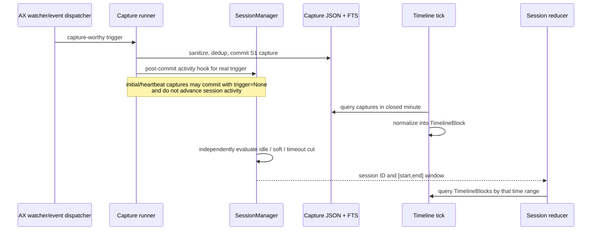
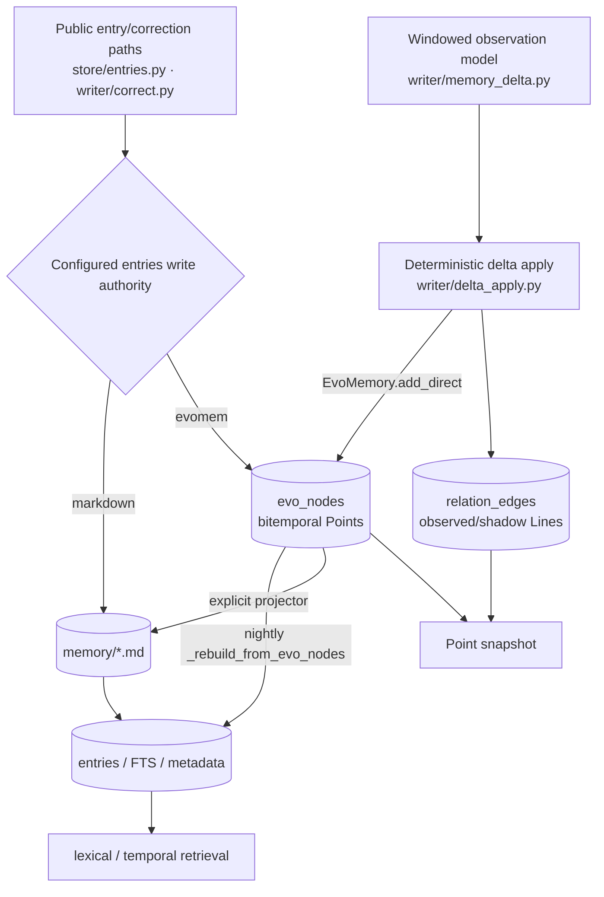
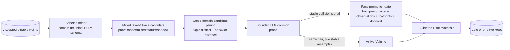

# Persome Runtime code atlas

This atlas explains what the repository *does* from the code outward. It is not
a restatement of product language and it is not an import graph presented as a
runtime graph. Its job is to let a new owner answer four questions quickly:

1. What kind of thing is Persome Runtime?
2. What data exists at each stage, and what transformation creates the next?
3. Which source files and algorithms implement each transformation?
4. Which claims are proven by code/tests, and which remain inferred, optional,
   degraded, or currently inconsistent?

The source audit baseline is `origin/main` at `2818634`. The atlas change adds
documentation and validation tooling only; it does not alter Runtime behavior.

## Start here

If you have five minutes, read [the ontology](#the-ontology) and the
[end-to-end graph](#the-real-end-to-end-dataflow). If you have 30 minutes, then
open the [interactive explorer](viewer.html) and follow this path:

```text
ax-event-gate
  -> s1-observation
  -> privacy-pixel-gate
  -> s1-normalization
  -> capture-commit
  -> timeline-block
  -> active-reducer
  -> memory-delta
  -> delta-gate
  -> delta-apply
  -> face-mining
  -> volume-synthesis
  -> root-synthesis
  -> snapshot-projection
  -> local-read-surfaces
```

Then read [verified gaps](verified-gaps.md). Those gaps are part of the code
truth; hiding them would make the map less useful than the repository itself.

The generated references are:

| Artifact | What it proves |
|---|---|
| [Dataflow reference](generated/dataflow-reference.md) | Every semantic node's trigger, I/O, algorithm, state, failure mode, files, symbols, tests, and registered edges. |
| [Python module index](generated/module-index.md) | Every `src/persome/**/*.py` module, using its current docstring, public symbols and line numbers, internal imports, semantic-stage membership, and direct test imports. |
| [Tracked-file inventory](generated/repository-inventory.md) | Every tracked non-generated file, classified by role with a code/file-derived purpose. |
| [Package-domain import graph](generated/import-graph.mmd) | Static cross-domain Python import dependencies. This is intentionally separate from runtime Dataflow. |
| [Machine-readable atlas](generated/atlas.json) | The same stages, edges, modules, symbols, and tests for other tools. |
| [Interactive explorer](viewer.html) | Search/filter/drill-down over semantic stages and all Python modules without a server or network request. |

## The one-sentence answer

Persome Runtime is a local-first macOS evidence pipeline that turns permitted
screen context into bounded observations, bounded observations into temporal
state, temporal state into evidence-gated personal claims, personal claims into
progressively higher structure, and that structure into an auditable local
model for humans and MCP clients.

It is not a dashboard, task system, notifier, meeting recorder, computer-use
actuator, predictor/evaluation harness, or cloud user-profile service. Those
systems may consume the Runtime's model, but they are outside this repository.

## The ontology

The repository becomes much easier to understand when its objects are separated
by epistemic status—what the system is justified in claiming at each boundary.

### 1. Observation: “the machine exposed this context”

An observation is a source-attributed record of permitted local context. Its
canonical useful fields are time, application/window identity, focused element,
visible text, URL, optional local OCR text, and source receipts. It is not yet a
claim about the person.

```text
O_i = (t_i, source_i, app_i, window_i, focus_i, text_i, url_i, receipts_i)
```

Primary code: [`capture/scheduler.py`](../../src/persome/capture/scheduler.py),
[`capture/s1_parser.py`](../../src/persome/capture/s1_parser.py), and
[`store/fts.py`](../../src/persome/store/fts.py).

### 2. Bounded state: “these observations belong to this temporal window”

Persome has two parallel state mechanisms:

- a wall-clock minute normalizer creates `timeline_blocks` from committed
  captures;
- a deterministic activity state machine creates session start/end ranges from
  capture-worthy triggers.

The session cutter does **not** consume timeline blocks. Reducers later query
timeline blocks whose timestamps fall inside a session window.

```text
B_m = Normalize({O_i | t_i in minute m})
S_k = Cut(activity_triggers; idle_gap, sustained_single_app, max_duration)
```

Primary code: [`timeline/aggregator.py`](../../src/persome/timeline/aggregator.py)
and [`session/manager.py`](../../src/persome/session/manager.py).

### 3. Event memory: “this is a bounded account of what happened”

The reducer summarizes only the unflushed part of a session and appends it to a
daily event file. This is temporal compression, not yet the complete personal
model.

```text
E_(k,w) = Reduce({B_m | m overlaps session window w})
```

The reducer is LLM-mediated, but its window, schema, retry state, append point,
and heuristic exhaustion fallback are deterministic. Primary code:
[`writer/session_reducer.py`](../../src/persome/writer/session_reducer.py).

### 4. Point and Line proposal: “these claims may be supported by this window”

One LLM call proposes entities, assertions, events, relations, and possible
owner aliases. A proposal is not accepted state. It must quote bounded evidence
and pass deterministic identity, predicate, polarity, and confidence gates.

```text
P_(k,w) = LLM_delta(B_(k,w), E_(k,w), roster)
Delta_(k,w) = Gate(P_(k,w), quoted_evidence, identities, predicates, confidence)
```

Primary code: [`writer/memory_delta.py`](../../src/persome/writer/memory_delta.py)
and [`evomem/identity.py`](../../src/persome/evomem/identity.py).

### 5. Stored model state: “the model can now carry and audit this claim”

The clean delta is applied by deterministic code into evolution nodes and
relation edges. A Point is a fact/entity/event node with status, history, and
receipts; snapshots retain non-archived active, shadow, and historical Points.
A Line is either vertical evolution (`supersedes`) or a horizontal relation,
whose active/shadow status is a separate acceptance boundary.

```text
G_(t+1) = ApplyDeterministically(G_t, Delta_(k,w))
G = (Points, supersedes Lines, relation Lines, receipts, temporal history)
```

Primary code: [`writer/delta_apply.py`](../../src/persome/writer/delta_apply.py),
[`evomem/engine.py`](../../src/persome/evomem/engine.py), and
[`store/relation_edges.py`](../../src/persome/store/relation_edges.py).

### 6. Higher geometry: “repeated accepted evidence supports a structure”

Higher layers are not larger summaries of raw captures. They are structures
induced from already accepted evidence:

- **Face**: a stable, domain-local schema with source receipts. In current code,
  an active level-1 Face needs both mined and emergent provenance plus repeated,
  stable footprints; a mined schema alone remains a shadow/forming candidate.
- **Volume**: repeated behavior shared by topic-distinct, non-person Faces. It
  requires two stable resamples of the same pair.
- **Root**: zero or one apex synthesized from active Face/Volume/profile
  evidence. Missing evidence never justifies an empty replacement.

```text
Faces   = MineStableDomains(G)
Volumes = ConfirmCrossDomainBehavior(Faces)
Root    = SingletonSynthesis(Faces, Volumes, profile)
```

Primary code:
[`writer/schema_miner_stage.py`](../../src/persome/writer/schema_miner_stage.py),
[`writer/cross_domain_sweeper.py`](../../src/persome/writer/cross_domain_sweeper.py),
[`writer/root_synthesis.py`](../../src/persome/writer/root_synthesis.py), and
[`store/schema_faces.py`](../../src/persome/store/schema_faces.py).

### 7. Projection: “show the model without creating another model”

The snapshot is a read-only versioned projection. REST, MCP, CLI export, and the
viewer consume that projection or the retrieval layer; they do not define a
parallel model.

```text
Snapshot_t = Project(G_t, active Faces, active Volumes, live Root, manifest)
```

Primary code: [`model/snapshot.py`](../../src/persome/model/snapshot.py). The
viewer coordinates are computed in the browser by
[`resources/model_assets/layout.mjs`](../../resources/model_assets/layout.mjs),
not by the model build.

## The real end-to-end Dataflow

Legend:

- `SOURCE` reads reality or a trusted producer;
- `DET` is deterministic code;
- `LLM→GATE` means an LLM proposes and deterministic code decides acceptance;
- `STORE` is a durable state boundary;
- `VIEW` is read-only projection/access;
- dashed arrows are control or schedule edges, not payload flow.

```mermaid
flowchart LR
    subgraph C["Control plane"]
      DAEMON["Daemon task registry<br/>src/persome/daemon.py<br/>enable predicates + named asyncio tasks"]
      POLICY["Lifecycle / policy gate<br/>config.py · paths.py · onboarding.py · runtime_pid.py<br/>typed config + ownership revalidation"]
      MAINT["Daily safety sequence<br/>session/tick.py · integrity.py · evomem/backup.py<br/>catch-up + projection + optional forgetting + survivability"]
    end

    subgraph O["Observation"]
      AX["SOURCE AX events<br/>resources/mac-ax-watcher.swift<br/>capture/watcher.py<br/>AXObserver event stream"]
      E0["DET event gate<br/>capture/event_dispatcher.py<br/>debounce + dedup + min-gap"]
      ING["SOURCE trusted ingest<br/>api/routes.py · capture/scheduler.py<br/>auth + bounded payload normalization"]
      ACQ["DET capture candidate<br/>capture/ax_capture.py · window_meta.py · screenshot.py<br/>window + AX + optional pixels"]
      PRIV["DET capture privacy/pixel gate<br/>screen_state.py · placeholder.py · screenshot_crypto.py<br/>lock skip + secure metadata-only + encrypt-or-omit"]
      S1["DET S1 normalization<br/>capture/s1_parser.py · parsers/ · cmux_source.py<br/>focus + visible text + URL"]
      OCR["SOURCE local OCR<br/>ocr_subprocess.py · ocr_local.py · ocr_structure.py<br/>framed isolated PP-OCR + spatial row grouping"]
      CAP[("STORE capture evidence<br/>capture/scheduler.py · store/fts.py<br/>private JSON + captures FTS + retention")]
    end

    subgraph S["State formation"]
      TL["LLM→fallback minute block<br/>timeline/aggregator.py · timeline/store.py<br/>closed-minute normalization + heuristic fallback"]
      SES["DET session state machine<br/>session/manager.py · session/store.py<br/>idle + sustained app + max-duration cuts"]
    end

    subgraph M["Evidence-backed memory"]
      RED["LLM→schema active reducer<br/>writer/session_reducer.py<br/>unflushed window + persisted retry/fallback"]
      EVT[("STORE event daily memory<br/>writer/session_reducer.py · store/entries.py<br/>append-only session account")]
      FIN["DET terminal orchestrator<br/>writer/agent.py<br/>classifier + pattern + trailing range"]
      DELTA["LLM delta proposal<br/>writer/memory_delta.py<br/>bounded entity/assertion/event/relation candidates"]
      GATE["DET evidence gate<br/>memory_delta.py · evomem/identity.py<br/>quote + roster + predicate + confidence"]
      APPLY["DET apply<br/>writer/delta_apply.py<br/>entities + assertions + event relations + semantic relations + supersedes"]
      GRAPH[("STORE personal state<br/>evomem/engine.py · store/relation_edges.py · store/entries.py<br/>Points + Lines + receipts + history")]
      PAT[("STORE behavior memory<br/>writer/pattern_detector.py<br/>repeated evidence → observed skill")]
    end

    subgraph H["Structural modeling"]
      BUILD["DET build coordinator<br/>model/build.py · model/manifest.py<br/>flock + ordered outcomes + degraded manifest"]
      ENRICH["DET/LLM enrichment<br/>person_graph.py · case_extractor.py · relation_extractor.py<br/>typed entities + resolved cases + shadow Lines"]
      FACE["LLM→stability Face<br/>schema_miner_stage.py · schema_faces.py<br/>domain bundles + provenance + footprint gates"]
      VOL["DET/LLM Volume<br/>cross_domain_sweeper.py<br/>signature distance + fair bounded probes + 2 resamples"]
      ROOT["LLM→singleton Root<br/>root_synthesis.py · schema_faces.py<br/>budgeted synthesis + non-empty replace gate"]
      VEC[("VIEW optional vectors<br/>vectors_tick.py · store/vectors.py<br/>queue + batch embed + rebuildable matrix")]
    end

    subgraph P["Projection and access"]
      SNAP["VIEW versioned snapshot<br/>model/snapshot.py<br/>current/history projection + receipt closure + redaction"]
      RET["VIEW associative retrieval<br/>retrieval/associative.py · store/fts.py · retrieval/chains.py<br/>multi-pool RRF + recency/MMR + chain expansion"]
      SURF["VIEW owner-local surfaces<br/>mcp/server.py · api/routes.py · api/model_view.py · cli.py<br/>bearer/capability + bounded REST/MCP/viewer/CLI"]
      FIX["Explicit audited correction<br/>writer/correct.py<br/>candidate plan + allowed operation + re-forward"]
      REM["Explicit agent finding<br/>mcp/memory_write.py<br/>append + immutable provenance tags"]
    end

    AX --> E0 --> ACQ --> PRIV --> S1 --> CAP
    ING --> PRIV
    S1 -->|"AX poor + OCR enabled"| OCR
    OCR -. "async text backfill by capture ID" .-> CAP

    CAP -->|"closed wall-clock minute"| TL
    CAP -->|"post-commit activity trigger"| SES
    TL -->|"queried later by session time range"| RED
    SES -. "flush/end/retry window" .-> RED
    RED --> EVT
    RED -. "active flush" .-> DELTA
    SES -. "reduced session end" .-> FIN
    EVT --> FIN
    FIN -->|"trailing unmodeled range"| DELTA
    FIN --> PAT
    DELTA --> GATE --> APPLY --> GRAPH
    PAT --> GRAPH

    GRAPH -. "dirty / explicit / daily trigger" .-> BUILD
    GRAPH -->|"daily state"| MAINT
    MAINT -. "repair / retire / verify" .-> GRAPH
    MAINT -. "stranded sessions" .-> FIN
    BUILD --> ENRICH --> FACE --> VOL --> ROOT
    BUILD --> SNAP
    ROOT --> SNAP
    BUILD --> VEC --> RET
    GRAPH --> SNAP
    GRAPH --> RET
    SNAP --> SURF
    RET --> SURF
    FIX --> GRAPH
    REM --> GRAPH

    DAEMON -.-> E0
    DAEMON -.-> TL
    DAEMON -.-> SES
    DAEMON -.-> BUILD
    DAEMON -.-> SURF
    DAEMON -.-> MAINT
    POLICY -.-> DAEMON
```



The important topological correction is visible in the middle: only a
successful, non-duplicate committed capture carrying an original activity
trigger advances the session state machine. The same committed evidence feeds
the independent timeline clock. There is no `timeline-block -> session-cut`
data edge.

Every node in this diagram has a source-backed detailed entry in the
[generated Dataflow reference](generated/dataflow-reference.md).

## One capture produces two independent clocks

This sequence is the smallest accurate explanation of why a session is not a
folder of timeline blocks created in sequence.



This separation gives the Runtime two useful properties:

- evidence can still be captured during a heartbeat without falsely extending
  human activity;
- session boundary decisions stay deterministic and do not depend on an LLM
  timeline summary.

It also creates a current gap: reducer-side reconstruction omits persisted
focus/attention fields, so the advertised attention trajectory is empty in the
reducer prompt. See [verified gaps](verified-gaps.md#3-reducer-reconstruction-drops-focus-and-attention-fields).

## Incremental versus terminal modeling

There is one intended modeling entrance, not one active writer and another
terminal writer.

```mermaid
stateDiagram-v2
    [*] --> ActiveSession
    ActiveSession --> Flushed: every configured flush interval
    Flushed --> ReducedWindow: append event entry; advance flush_end
    ReducedWindow --> DeltaProposed: model [delta_end, flush_end]
    DeltaProposed --> DeltaApplied: persist delta; gate; apply
    DeltaApplied --> ActiveSession: advance delta_end

    ActiveSession --> Ended: idle / soft cut / timeout / force end
    Ended --> Reducing: terminal reducer or retry
    Reducing --> Reduced: success or heuristic exhaustion
    Reduced --> Finalizing: session-model.lock
    Finalizing --> ClassifierDone: compatibility catch-up
    ClassifierDone --> PatternDone: repeated-pattern detector
    PatternDone --> TailApplied: model [delta_end, end_time]
    TailApplied --> Modeled: set modeled_at
    Modeled --> [*]

    Reducing --> Retryable: malformed/provider failure
    Retryable --> Reducing: next_retry_at / recovery / safety net
    Finalizing --> Retryable: any enabled terminal stage fails
```



The watermarks are:

| Field | Meaning | Writer |
|---|---|---|
| `flush_end` | Timeline range already reduced to event memory. | `writer/session_reducer.py` |
| `classified_end` | Compatibility classifier range already handled. | `writer/agent.py` + `writer/classifier.py` |
| `pattern_detected_end` | Behavior-pattern range already handled. | `writer/agent.py` + `writer/pattern_detector.py` |
| `delta_end` | Point/Line window already applied during active or terminal modeling. | `writer/agent.py` |
| `modeled_at` | All terminal stages completed or benignly skipped. | `writer/agent.py` |
| `memory_deltas.apply_status` | `pending`, `applied`, `failed`, or legacy/not-requested apply state. | `writer/memory_delta.py` |

`session-model.lock` prevents concurrent *entrances*, but it does not by itself
make every item inside a partially committed additive delta idempotent. That
distinction matters and is documented in the gaps report.

## Storage is a set of authorities and projections, not one straight line

The current code has more than one accepted write entrance. A simple
“Markdown is truth, SQLite is only an index” diagram is incomplete.



Concrete consequences:

- default `memory_delta` Points are direct `evo_nodes` writes, even when the
  general entries write authority is `markdown`;
- the daily safety net rebuilds SQLite entries/FTS from evomem, but it does not
  write physical Markdown files;
- physical Markdown projection from evomem is explicit or specific to the
  evomem-authority public entry path;
- therefore “human-readable Markdown”, “searchable entry projection”, and
  “current Point in evomem” can have different freshness.

This is a code fact, not a recommendation. The inconsistency it can create for
`list_memories` versus disk-based `read_memory` is tracked in
[verified gaps](verified-gaps.md#6-direct-evomem-writes-do-not-guarantee-a-physical-markdown-projection).

All SQLite access should still use `with fts.cursor() as conn:`; the store uses
WAL mode and transaction-scoped schema/projection hooks.

## How Face, Volume, and Root actually become live



This graph explains a subtle but important implementation fact: a stable schema
miner result does not by itself activate a Face. Current `schema_faces` logic
requires an emergent/cross-domain signal as well. That means Face activation is
coupled to the cross-domain stage, not only to domain-local evidence.

## Snapshot and viewer are separate algorithms

The snapshot answers “what model objects are current and auditable?” The viewer
answers “where should those objects be placed on screen?”

| Concern | Algorithm | Source |
|---|---|---|
| Point selection | All non-archived evolution nodes, including historical and shadow Points required for inspection/chains. | [`model/snapshot.py`](../../src/persome/model/snapshot.py) |
| Line selection | Supersedes plus active relation edges; shadow relations stay out of the snapshot. | [`model/snapshot.py`](../../src/persome/model/snapshot.py) |
| Geometry selection | Active level-1/2/3 schema rows, with at-most-one Root validation. | [`model/snapshot.py`](../../src/persome/model/snapshot.py) |
| Receipt closure | Resolve Point/relation receipts and inherited Face/Volume/Root source receipts. | [`model/snapshot.py`](../../src/persome/model/snapshot.py) |
| Export privacy | Deterministic redaction, atomic private write, mode `0600`. | [`model/snapshot.py`](../../src/persome/model/snapshot.py) |
| Browser layout | FNV-1a-stable hashes, golden-angle placement, receipt overlap, and union-find cluster assignment. | [`resources/model_assets/layout.mjs`](../../resources/model_assets/layout.mjs) |

Associative retrieval has a different visibility policy: when
`search.relation_include_shadow=true` (the default), shadow relation candidates
may contribute at reduced weight to recall even though they are invisible in
the model snapshot. “Not displayed as accepted model geometry” therefore does
not mean “never used as a retrieval hint.”

## Daemon tasks and what they own

The registry in [`daemon.py`](../../src/persome/daemon.py) is the source of
truth for long-running tasks.

| Task | Trigger/cadence | Owns | Does not prove |
|---|---|---|---|
| `capture` | continuous watcher or ingest runner | S1 observation, commit, capture receipt, activity hook | timeline block or accepted personal claim |
| `session` | configured short tick | deterministic cuts and callbacks | timeline normalization |
| `reducer-retry` | 60 seconds | pending reducer and terminal-model recovery | only reduction; it may also finalize Points/Lines |
| `daily-safety-net` | configured local time (default 23:55) | force end, writer catch-up, entry projection, maintenance, backup/checkpoint/snapshot work | a pure backup-only task |
| `timeline` | 60 seconds | closed minute blocks and capture retention | session boundaries |
| `flush` | configured session flush interval | event reduction and active Point/Line modeling | terminal completion |
| `classifier-tick` | compatibility mode only | legacy classifier when delta apply is off | default durable-fact path |
| `vector-embed-tick` | 60 seconds when hybrid enabled | embedding queue | model authority |
| `schema-tick` | default 00:15 | unconditional shared model build | a separate build implementation |
| `model-refresh` | dirty-gated configured interval | shared model build | coordinate generation in Python |
| `mcp` | continuous when configured | HTTP MCP, REST, and viewer server | cloud publication |

`--capture-only` disables timeline, flush, classifier, vectors, schema tick, and
model refresh. It still keeps capture, session, reducer retry, daily safety net,
and configured MCP. Because retry and the safety net call the shared writer, the
mode is not an absolute “never produce Points/Lines” switch.

## Recovery, forgetting, and maintenance are part of the model

The Runtime's state is shaped not only by the forward writer. Recovery,
projection, retention, forgetting, and explicit erasure decide what remains
queryable and auditable. The daily sequence is ordered, not a bag of parallel
jobs:

```mermaid
flowchart LR
    END["Force-end open session<br/>session/tick.py"]
    CATCH["Writer catch-up<br/>writer/agent.py"]
    PROJ["Evo → entries projection<br/>store/entries.py"]
    CONTRA["Optional contradiction ledger<br/>writer/contradiction_check.py"]
    DECAY["Optional text-axis decay<br/>writer/memory_decay.py"]
    REAP["Optional orphan retirement<br/>writer/orphan_reaper.py"]
    WAL["WAL truncate + telemetry prune<br/>store/fts.py · store/parser_ticks.py"]
    BACK["Verified retained backup<br/>evomem/backup.py"]
    CHECK["Live integrity check<br/>evomem/integrity.py"]
    EDIT["Manual-edit detection<br/>evomem/inversion.py"]

    END --> CATCH --> PROJ --> CONTRA --> DECAY --> REAP --> WAL --> BACK --> CHECK --> EDIT
```



That exact order exposes a current gap: when orphan retirement is enabled, it
changes evomem *after* the retrieval projection. The verified backup then sees
an active-head/live-entry mismatch and can discard the new backup; retrieval
does not converge until another projection. The finding and the repair choices
are in [verified gaps](verified-gaps.md#11-daily-orphan-retirement-runs-after-retrieval-projection).
The same ledger records the missing
[durable missed-run recovery](verified-gaps.md#12-daily-maintenance-has-no-durable-missed-run-recovery),
the [private non-transactional projection entrance](verified-gaps.md#13-daily-projection-bypasses-the-public-rebuild-transaction),
and [contradiction flags lost on reprojection](verified-gaps.md#14-contradiction-marks-do-not-survive-evomem-reprojection).

Other non-forward state transitions are equally explicit:

| Transition | Trigger and core algorithm | Source |
|---|---|---|
| Startup recovery | Before offline mutable CLI/start: integrity check, derived-FTS repair or journaled quarantine/verified-backup restore, authority reconciliation, projection rebuild, derived-geometry invalidation. A pending journal blocks writes/build/start. | [`integrity.py`](../../src/persome/integrity.py), [`cli.py`](../../src/persome/cli.py) |
| Capture/pixel forgetting | After timeline materialization: use the latest closed-block end as safety watermark, age-strip pixels, thumbnail configured screenshots, delete expired frames, and enforce a hard disk cap with index reconciliation. | [`capture/scheduler.py`](../../src/persome/capture/scheduler.py), [`timeline/tick.py`](../../src/persome/timeline/tick.py) |
| Compatibility compaction | Only after a successful legacy classifier commit and its persisted cadence: whole-file LLM rewrite, frontmatter plus ≥95% unique-token preservation gate, atomic replace, one rebuild, evomem repair. Default delta apply never enters it. | [`writer/classifier.py`](../../src/persome/writer/classifier.py), [`writer/compact.py`](../../src/persome/writer/compact.py) |
| Vector maintenance | Non-capture-only hybrid mode every 60 seconds: bounded queued embedding batches, retry on failure, orphan/superseded vector GC, dimension-compatible live matrix. | [`vectors_tick.py`](../../src/persome/vectors_tick.py), [`store/vectors.py`](../../src/persome/store/vectors.py) |
| Manual projection import | Under evomem authority, compare projected Markdown hashes; report edits but never auto-import. Explicit import accepts safe new active adds and surfaces ambiguous modification/deletion/chain edits as conflicts. | [`evomem/inversion.py`](../../src/persome/evomem/inversion.py) |
| Secure erasure | Confirmed `persome clean` with daemon stopped: scrub the chosen scope from live DB, WAL/FTS, backup/quarantine copies, files, exports, and recovery artifacts; fail loudly if a known retained copy cannot be removed. | [`cli.py`](../../src/persome/cli.py), [`evomem/backup.py`](../../src/persome/evomem/backup.py), [`store/fts.py`](../../src/persome/store/fts.py) |

## Trust and privacy boundaries

The local-first property comes from enforceable boundaries, not the word
“local”:

- every runtime path comes from [`paths.py`](../../src/persome/paths.py);
- `config.toml` holds non-secret routing, while `<PERSOME_ROOT>/env` holds key
  values;
- screenshot pixels are encrypted only with a valid install-generated key, or
  omitted;
- OCR is a local subprocess with vendored models and bounded framed messages;
- the HTTP server validates loopback binding by default;
- canonical `GET /health` is public; the browser bootstrap endpoint also skips
  bearer auth but requires a short-lived one-use capability nonce before it
  creates an HttpOnly viewer session;
- all remaining REST/viewer/HTTP MCP routes require owner-local bearer or
  viewer capability authorization;
- model exports are redacted by default and written owner-only.

Loopback access is still access to personal data. The map therefore treats REST
and MCP as a trust boundary, not merely a UI layer.

## Failure semantics in one view

| Boundary | Failure behavior |
|---|---|
| AX unavailable / poor | Preserve metadata and optionally try explicitly enabled local OCR; do not fabricate text. |
| Screen locked / lock state uncertain | Skip the whole capture before acquisition. |
| Secure input focused | Persist timestamp/window metadata only; strip AX, text, URL, pixels, and OCR opportunity. |
| OCR worker timeout/crash | Restart/fail open to AX-only capture; keep daemon alive. |
| Timeline LLM failure | Write deterministic heuristic block. |
| Reducer malformed/provider failure | Persist retry; terminal exhaustion writes a coarse heuristic event. |
| Memory-delta LLM failure | Leave `delta_end` unchanged; retry the range. |
| Gating rejects an item | Drop/count it; never coerce unsupported evidence into a claim. |
| Delta apply raises | Mark failed and retry stored payload without another LLM call. Partial additive replay remains a current gap. |
| Terminal stage error | Keep `modeled_at` null so recovery can resume. |
| Model build overlap | Wait under `flock` or report busy. |
| Higher geometry missing/failed | Mark degraded; do not fabricate geometry or erase a valid Root. |
| Snapshot invariant failure | Raise/report `not_built`; do not guess a valid public contract. |
| Missing vector credentials | Keep BM25 and model state; semantic retrieval degrades. |

## Where every source file fits

The detailed module index groups all 140 Python modules into eight code domains:

1. runtime and lifecycle;
2. configuration and observability;
3. capture, parsers, and privacy;
4. timeline and session state;
5. reducers and model writers;
6. storage and evolution graph;
7. model build and snapshot;
8. retrieval, API, MCP, and security.

Use the [module index](generated/module-index.md) when you know a file and need
its upstream/downstream position. Use the [Dataflow reference](generated/dataflow-reference.md)
when you know a logical stage and need its implementing files. Use the
[tracked-file inventory](generated/repository-inventory.md) when you need to
confirm that a script, prompt, Swift helper, test fixture, workflow, or document
has not been omitted.

### Recommended code-reading order

Read symbols, not whole directories, in this order:

1. `daemon._build_task_registry` — learn what is actually alive.
2. `capture.scheduler._CaptureRunner._commit` — learn the observation/session
   fork and commit semantics.
3. `timeline.aggregator.produce_block_for_window` — learn minute state.
4. `session.manager.SessionManager` and `session.store.SessionRow` — learn the
   independent session clock and watermarks.
5. `writer.session_reducer._reduce_window_locked` — learn event compression.
6. `writer.agent.model_active_session` and `finalize_session` — learn the one
   intended modeling entrance.
7. `writer.memory_delta._ensure_window` and `gate_delta` — learn proposal versus
   acceptance.
8. `writer.delta_apply.apply_delta` — learn concrete Point/Line writes.
9. `model.build.ModelBuildCoordinator` — learn higher-stage ordering.
10. `store.schema_faces.maybe_promote` — learn why geometry becomes active.
11. `model.snapshot.build_snapshot` — learn the public model contract.
12. `mcp.server.build_server` and `security.auth.LocalAPIAuthMiddleware` — learn
    access and trust boundaries.

## Evidence strength

This atlas keeps four evidence types separate:

| Mark | Meaning |
|---|---|
| `S` | Static source fact: a path, symbol, import, branch, state write, or call exists. |
| `T` | Test evidence: a repository test directly exercises or imports the behavior. |
| `R` | Runtime trace evidence: a canonical scenario actually executed this path. Not yet comprehensively instrumented here. |
| `M` | Maintainer-audited semantic interpretation: why the transform exists and what its data means. |

The generated AST/import inventory is `S`. Linked tests add `T`. The curated
stage registry combines `S + T + M`. A future local, content-free trace suite
can add `R`; an import graph alone cannot.

## Keeping the atlas honest

The semantic registry is [`stages.toml`](stages.toml). The generator validates
that every referenced file and test exists and every symbol resolves to a real
definition or supported declaration in one of that stage's listed source files.
It then regenerates all mechanical facts:

```bash
uv run python scripts/generate_code_atlas.py
uv run python scripts/generate_code_atlas.py --check
```

The check is also covered by `tests/test_code_atlas.py`. A change should fail if:

- a Python module no longer maps to exactly one code domain;
- a stage points to a removed source/test file or a symbol without a real
  definition/declaration in its listed source files;
- generated module/import/file facts drift;
- an unexpected stale file remains in the generator-owned output directory;
- the interactive viewer no longer embeds the same machine-readable atlas.

The generator does **not** pretend to infer algorithm meaning. Stage semantics
remain reviewable TOML because data meaning, temporal ownership, failure policy,
and cross-process idempotency cannot be recovered reliably from imports.

See [methodology and tooling research](methodology.md) for why this hybrid was
chosen over one-click dependency visualizers, Doxygen/Sphinx-only output, or a
single unverified architecture diagram.
