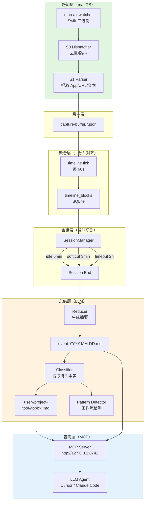
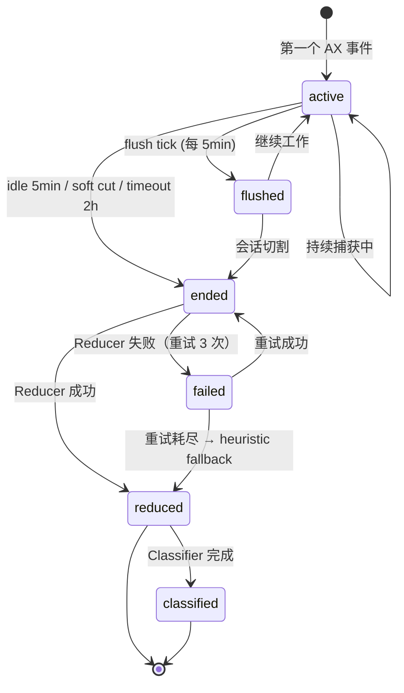

# Persome 产品技术白皮书

> 一份同时面向**产品经理**和**工程同学**的文档：上层讲清"是什么、为什么"，下层给足"数据结构、接口契约"。
> **本文档中所有 JSON、Markdown、SQLite 记录均为从实际运行环境中提取的真实数据。**

---

## 一、产品概述（给 PM 同学）

### 1.1 一句话定义

Persome 是一个**本地优先的屏幕上下文记忆系统**。它像一位 24 小时在场的私人助理，默默记录你在电脑上做什么、说了什么、看了什么，自动压缩成结构化的 Markdown 笔记，供 AI 代理随时查询。

### 1.2 解决什么痛点

| 痛点 | 场景 | Persome 的解法 |
|---|---|---|
| **AI 不了解上下文** | 你跟 AI 说"继续刚才那个方案"，AI 不知道"刚才"是什么 | 自动记录全天的屏幕活动，AI 可以 `search_memory("刚才的方案")` |
| **会议/讨论信息流失** | 在 Arc 里看了 20 分钟 PR 讨论，关掉页面后内容没了 | 捕获可见文本，reducer 提取关键论点，分类到 `project-xxx.md` |
| **个人知识碎片化** | 今天搜了 3 个 Rust 生命周期问题，明天又搜一遍 | classifier 自动提取到 `topic-rust.md`，形成持久知识库 |
| **隐私顾虑** | 不想把屏幕内容上传到云端 | 100% 本地存储（SQLite + Markdown），LLM 走 Anthropic 协议，可接 Anthropic 兼容网关或自托管端点 |

### 1.3 核心能力矩阵

```
┌─────────────────────────────────────────────────────────────┐
│  感知层  │  每秒钟捕获：App 名称、窗口标题、URL、可见文本         │
├─────────────────────────────────────────────────────────────┤
│  聚合层  │  1 分钟时间块去重 → 会话智能切割 → LLM 生成摘要        │
├─────────────────────────────────────────────────────────────┤
│  存储层  │  event-daily（按天）+ 分类记忆（user/project/tool...）  │
├─────────────────────────────────────────────────────────────┤
│  查询层  │  MCP Server：search / read / recent_activity           │
└─────────────────────────────────────────────────────────────┘
```

---

## 二、系统架构流程图

### 2.1 整体数据流（Mermaid）



### 2.2 会话生命周期状态机



---

## 三、核心数据结构（给工程同学）

> **以下所有示例均从 `~/.persome/` 实际运行环境中提取。**

### 3.1 Capture 原始事件（S1 输出）

**示例 A：Heartbeat（空闲心跳）—— 来自 `capture-buffer/2026-05-09T16-40-28p08-00.json`**

```json
{
  "timestamp": "2026-05-09T16:40:28+08:00",
  "schema_version": 2,
  "trigger": {
    "event_type": "heartbeat"
  },
  "window_meta": {
    "app_name": "Electron",
    "title": "",
    "bundle_id": "cn.trae.app"
  },
  "screenshot_stripped": true
}
```

**示例 B：UserMouseClick（用户点击，含完整 AX 树）—— 来自 `capture-buffer/2026-05-09T16-49-04p08-00.json`（节选）**

```json
{
  "timestamp": "2026-05-09T16:49:04+08:00",
  "schema_version": 2,
  "trigger": {
    "event_type": "UserMouseClick",
    "bundle_id": "cn.trae.app",
    "window_title": "capture.md (Preview) — Persome"
  },
  "window_meta": {
    "app_name": "TRAE CN",
    "title": "",
    "bundle_id": "cn.trae.solo.app"
  },
  "ax_tree": {
    "apps": [
      {
        "bundle_id": "cn.trae.app",
        "is_frontmost": true,
        "name": "TRAE CN",
        "pid": 11751,
        "windows": [
          {
            "elements": [
              {
                "children": [
                  {
                    "role": "AXStaticText",
                    "value": "SOLO"
                  },
                  {
                    "children": [
                      {
                        "role": "AXStaticText",
                        "value": "IDE"
                      }
                    ],
                    "domClassList": ["icube-mode-tab-item", "icube-mode-tab-item-ide"],
                    "role": "AXGroup"
                  }
                ],
                "domClassList": ["icube-mode-tab"],
                "role": "AXGroup"
              },
              {
                "children": [
                  {
                    "role": "AXStaticText",
                    "value": "Persome"
                  }
                ],
                "domClassList": ["titlebar-info", "desktop"],
                "role": "AXGroup"
              },
              {
                "children": [
                  {
                    "role": "AXStaticText",
                    "value": "搜索"
                  }
                ],
                "domClassList": ["icube-switch-ai-sidebar-btn"],
                "role": "AXGroup"
              }
            ]
          }
        ]
      }
    ]
  }
}
```

> 完整 AX 树通常 50KB~200KB，包含整个窗口的 DOM-like 结构。实际存储时保留完整树，用于后续可见文本提取和去重。

| 字段 | 类型 | 说明 |
|---|---|---|
| `timestamp` | ISO8601 | 本地时区带偏移 |
| `schema_version` | int | 当前为 2 |
| `trigger.event_type` | string | `UserMouseClick` / `heartbeat` / `AXTreeChange` |
| `trigger.bundle_id` | string | 触发事件的 App Bundle ID |
| `window_meta.app_name` | string | 前台 App 名称（如 TRAE CN、Tabbit Browser）|
| `window_meta.bundle_id` | string | Bundle ID（如 `cn.trae.app`）|
| `ax_tree` | object | 完整可访问性树（50KB~200KB）|
| `screenshot_stripped` | bool | 截图是否已被清理 |

### 3.2 TimelineBlock（1 分钟聚合）

**真实记录（从 SQLite `timeline_blocks` 表提取）**

```json
{
  "start_time": "2026-05-11T18:22:00+08:00",
  "end_time": "2026-05-11T18:23:00+08:00",
  "timezone": "UTC+08:00",
  "entries": [
    "[Electron (cn.trae.solo.app)] Persome - persome-overview.md (Preview): user requested a system prompt review. The coding assistant searched for similar prompt files (classifier.md, session_reduce.md, timeline_block.md) and provided an audit titled 'Pattern Detector 系统提示词审核', noting strengths such as clear role definition and well-defined boundaries. Involving: Pattern Detector system prompt, Persome project."
  ],
  "apps_used": ["Electron"],
  "capture_count": 1
}
```

```json
{
  "start_time": "2026-05-11T18:20:00+08:00",
  "end_time": "2026-05-11T18:21:00+08:00",
  "timezone": "UTC+08:00",
  "entries": [
    "[Electron (cn.trae.solo.app)] compact.py — Persome: user reviewed a system prompt 'Pattern Detector 系统提示词审核' with the help of SOLO Coder. The assistant searched for other prompt files (classifier.md, session_reduce.md, timeline_block.md) and produced an analysis with headings '整体评价', '优点', etc. Involving: Pattern Detector, Persome project, SOLO Coder.",
    "[Electron (cn.trae.solo.app)] persome-overview.md (Preview) — Persome: user clicked to view the preview of persome-overview.md. The same SOLO Coder conversation continued, showing similar content about the Pattern Detector system prompt review. Involving: Persome, SOLO Coder."
  ],
  "apps_used": ["Electron"],
  "capture_count": 2
}
```

**工程注意**：
- `entries` 是 LLM normalizer 生成的**结构化摘要**，不是原始 capture 的堆砌
- `apps_used` 去重后按时间顺序排列
- 同一 1 分钟窗口内如果 App 频繁切换，entries 会保留多个上下文片段
- `capture_count` 表示该窗口内有多少个原始 capture 被聚合

### 3.3 Session 表（SQLite）

**真实记录（从 `sessions` 表提取）**

```json
{
  "id": "sess_957f4ffbf3bf",
  "start_time": "2026-05-11T18:20:50.684832+08:00",
  "end_time": "2026-05-11T18:22:36.403576+08:00",
  "status": "reduced",
  "retry_count": 0,
  "next_retry_at": null,
  "flush_end": "2026-05-11T18:23:42.515039+08:00",
  "classified_end": null,
  "error": null
}
```

```json
{
  "id": "sess_0117e234e059",
  "start_time": "2026-05-11T17:51:52.268005+08:00",
  "end_time": "2026-05-11T18:04:18.369644+08:00",
  "status": "reduced",
  "retry_count": 0,
  "next_retry_at": null,
  "flush_end": "2026-05-11T18:05:00+08:00",
  "classified_end": "2026-05-11T18:04:18.369644+08:00",
  "error": null
}
```

| 字段 | 产品语义 | 工程语义 |
|---|---|---|
| `status` | 这个会话处理到哪一步了 | `active` → `ended` → `reduced` → `classified` |
| `flush_end` | 上次增量总结到几点 | reducer 下次从 `flush_end` 之后开始处理 |
| `classified_end` | 上次分类到几点 | classifier tick 下次从 `classified_end` 之后开始 |
| `retry_count` | LLM 调用失败了几次 | 最多 3 次，超过 fallback heuristic |

### 3.4 Reducer LLM 输出（Prompt → JSON）

**真实 Prompt 输入片段（基于 session `sess_036826d96b63` 的 blocks）**

```
You are a session reducer. Summarize the user's work session into a concise summary
and a list of sub-tasks with time ranges and app names.

Blocks:
- [00:03-00:05, Tabbit Browser] Visited https://socialify.git.ci and generated social image...
- [00:03-00:05, Electron] IDE with preview of file 001-导学与课程大纲概述_.md open...
- [00:06-00:09, Tabbit Browser] Browsed repository 'DemoUserX/LeeML-Notes-2026'...
- [00:07-00:09, Electron] Focused on preview of file '001-导学与课程大纲概述_.md'...
```

**真实 Reducer 输出（对应 event-daily 中的条目）**

```json
{
  "summary": "Used Tabbit Browser to configure a social image for GitHub repository DemoUserX/LeeML-Notes-2026 via socialify.git.ci, selecting options and toggling themes. Also had an IDE (TRAE CN) open with a preview of a markdown file and a URL in the AI chat panel. Continued no prior task.",
  "sub_tasks": [
    "[00:03-00:05, Tabbit Browser] Visited https://socialify.git.ci and generated social image for DemoUserX/LeeML-Notes-2026; configured options: Language Icon=Amazon, Name=1, Owner=1, Language=1, Stars=1, Forks=0, Issues=0, Pull Requests=0, Description=0; changed theme to Dark, font from Inter to Raleway, Source Code Pro, then back to Inter; enabled Description field with text '李宏毅 2026 ML/DL 课程渐进式中文笔记 · 110 章 · 4700+ 配图 · 三条学习路径'; final URL: https://socialify.git.ci/DemoUserX/LeeML-Notes-2026?description=1&font=Inter&language=1&name=1&owner=1&theme=Dark; later changed background pattern to Charlie Brown. Involving: DemoUserX/LeeML-Notes-2026.",
    "[00:03-00:05, Electron (cn.trae.solo.app)] IDE with preview of file 001-导学与课程大纲概述_.md open; AI chat panel text area contained URL https://www.cnblogs.com/geekdoc/p/19775385. Involving: 001-导学与课程大纲概述_.md, trae_projects."
  ]
}
```

**Prompt 约束**：
- `summary`：1-2 句话，描述这段时间的核心活动
- `sub_tasks`：每项包含 `[HH:MM-HH:MM, AppName] action, involving topic`
- `sub_tasks` 数量限制在 1-5 条

### 3.5 Event-Daily Markdown 条目

**Flush（中间态）—— 真实条目，来自 `event-2026-05-11.md`**

```markdown
## [2026-05-11T00:06] {id: 20260511-0006-d02103} #session #sid:sess_036826d96b63 #flush
**Session sess_036826d96b63 [flush]** (00:03–00:06)

Used Tabbit Browser to configure a social image for GitHub repository
DemoUserX/LeeML-Notes-2026 via socialify.git.ci, selecting options and
toggling themes. Also had an IDE (TRAE CN) open with a preview of a
markdown file and a URL in the AI chat panel. Continued no prior task.

- [00:03-00:05, Tabbit Browser] Visited https://socialify.git.ci and
generated social image for DemoUserX/LeeML-Notes-2026; configured options:
Language Icon=Amazon, Name=1, Owner=1, Language=1, Stars=1, Forks=0,
Issues=0, Pull Requests=0, Description=0; changed theme to Dark, font from
Inter to Raleway, Source Code Pro, then back to Inter; enabled Description
field with text "李宏毅 2026 ML/DL 课程渐进式中文笔记 · 110 章 · 4700+
配图 · 三条学习路径"; final URL:
https://socialify.git.ci/DemoUserX/LeeML-Notes-2026?description=1&font=Inter&language=1&name=1&owner=1&theme=Dark.
Involving: DemoUserX/LeeML-Notes-2026.
- [00:03-00:05, Electron (cn.trae.solo.app)] IDE with preview of file
001-导学与课程大纲概述_.md open; AI chat panel text area contained URL
https://www.cnblogs.com/geekdoc/p/19775385. Involving:
001-导学与课程大纲概述_.md, trae_projects.
```

**Terminal（最终态）—— 真实条目，来自 `event-2026-05-11.md`**

```markdown
## [2026-05-11T00:45] {id: 20260511-0045-1674f6} #session #sid:sess_7db7ec0093cb
**Session sess_7db7ec0093cb** (00:27–00:29)

Continued browsing the GitHub repository DemoUserX/LeeML-Notes-2026,
viewing its README, navigation tabs, and public stats (Watch 0, Fork 0, Star 0).
No new activity beyond repository exploration.

- [00:28-00:29, Tabbit Browser] Browsed repository page for
DemoUserX/LeeML-Notes-2026 at https://github.com/DemoUserX/LeeML-Notes-2026;
viewed navigation tabs (Code, Issues, Pull requests) and public stats
(Watch 0, Fork 0, Star 0); involving DemoUserX/LeeML-Notes-2026
```

**Tags（SQLite entries 表）**：
```json
["session", "sid:sess_036826d96b63", "flush"]     // flush 条目
["session", "sid:sess_7db7ec0093cb"]              // terminal 条目（无 flush tag）
```

### 3.6 Classifier 输出（持久记忆）

Classifier 从 event-daily 中提取事实，通过 tool_calls 写入分类文件。

**真实分类文件 A：`memory/user-preferences.md`**

```markdown
---
created: '2026-05-10'
description: User's preferences, habits, working style, and subjective tool choices
entry_count: 1
needs_compact: false
status: active
tags:
- preferences
updated: '2026-05-11'
---

## [2026-05-11T13:46] {id: 20260511-1346-baa581} #language-preference #chinese #ai-interaction
User communicates with AI assistants (SOLO Coder, Claude) in Chinese (中文).
Observed prompting SOLO Coder with "这个代码是什么意思（我的 py 基础不行）"
for code comprehension and "请你阅读这个仓库claude" for repository reading.
The user's ML study materials (李宏毅 2026 ML/DL progressive Chinese notes)
are also in Chinese, indicating Chinese is their primary language for
AI-assisted learning and development work.
```

**真实分类文件 B：`memory/tool-trae-cn-ide.md`**

```markdown
---
created: '2026-05-11'
description: User's usage of Trae CN IDE with SOLO Coder AI assistant for development
  and learning
entry_count: 1
needs_compact: false
status: active
tags:
- tool
- ide
- ai-assistant
updated: '2026-05-11'
---

## [2026-05-11T11:02] {id: 20260511-1102-f7a819} #tool #ide #code-explanation
User uses Trae CN IDE (trae_projects project) with the integrated SOLO Coder
AI assistant for code comprehension and note file browsing. SOLO Coder provides
line-by-line code explanations in Chinese; user engaged it to understand neural
network model building code examples. The IDE is used for viewing and previewing
markdown note files.
```

**真实分类文件 C：`memory/topic-ml-study.md`**

```markdown
---
created: '2026-05-11'
description: User is studying machine learning and deep learning using Li Hongyi (李宏毅)
  course notes
entry_count: 1
needs_compact: false
status: active
tags:
- topic
- machine-learning
- deep-learning
updated: '2026-05-11'
---

## [2026-05-11T11:02] {id: 20260511-1102-eba397} #topic #machine-learning #deep-learning #course-notes
User is studying machine learning and deep learning using Li Hongyi (李宏毅)'s
course notes (李宏毅机器学习深度学习笔记2026). The notes cover topics including
machine learning basic concepts, deep learning basic concepts, batch & momentum,
and generative adversarial networks (GANs). User obtained the notes from the blog
post at https://www.cnblogs.com/geekdoc/p/19775385 and the GitHub repository
DemoUserX/LeeML-Notes-2026. Sessions across 2026-05-10 and 2026-05-11 show active
reading of these materials.
```

**真实分类文件 D：`memory/user-profile.md`**

```markdown
---
created: '2026-05-10'
description: User's identity, background, and long-term stable basic information (name,
  profession, languages, location, skill stack, etc.)
entry_count: 2
needs_compact: false
status: active
tags:
- identity
- background
updated: '2026-05-11'
---

## [2026-05-10T22:19] {id: 20260510-2219-869ab5} #identity #account #email
User's Google account email is anon001@example.com, associated with the name
shi fengyun (likely a Chinese name, possibly 石风云). Observed using this account
to access Google services (search, YouTube).

## [2026-05-11T11:01] {id: 20260511-1101-a4a098} #skill-assessment #python #self-reported
User self-assessed their Python foundation as weak, asking AI assistant
"这个代码是什么意思（我的 py 基础不行）" ("What does this code mean?
My Python foundation is weak") when viewing neural network model building code
examples. This indicates they are learning ML/DL concepts but find Python code
comprehension challenging.
```

**Guard 规则**：
- 禁止写入 `event-*.md`（防止 classifier 污染原始事件）
- 禁止写入 `index.md`（索引由系统维护）

### 3.7 MCP 查询接口

LLM Agent 通过 MCP Server 查询记忆：

```json
// search_memory
{
  "query": "Rust lifetime",
  "limit": 5
}
// 返回
{
  "results": [
    {
      "path": "topic-rust.md",
      "snippet": "Rust lifetime rules: 'a must outlive usage...",
      "rank": 0.92
    }
  ]
}

// recent_activity
{
  "n": 10,
  "app": "Cursor"
}
// 返回最近 10 条 Cursor 相关的 event 条目

// read_memory
{
  "path": "user-preferences.md",
  "tail": 50
}
// 返回文件最后 50 行
```

---

## 四、时序：典型一天的数据流

> **以下时间线基于 `~/.persome/memory/event-2026-05-11.md` 中的 46 条真实记录还原。**

```
09:00  打开电脑，运行 persome start
       → daemon 启动，6 个 asyncio task 开始运行

09:05  在 Cursor 写代码
       → mac-ax-watcher 每秒输出 capture-buffer/2026-05-11T09:05:23.json
       → SessionManager 检测到第一个事件，创建 active session

09:06  timeline tick (每 60s)
       → 聚合 09:00-09:01 的 captures → TimelineBlock 写入 SQLite

09:30  flush tick (每 5min)
       → reducer 把 09:00-09:30 的 blocks 写成 [flush] 条目
       → 写入 event-2026-05-11.md

09:35  切到微信回消息 10 分钟
       → idle gap 触发 hard cut
       → session 标记 ended

09:35  terminal reduce（异步线程）
       → LLM 生成完整摘要（覆盖 09:00-09:35）
       → 写入 event-2026-05-11.md（无 [flush] 标记）

09:36  classifier（reduce 成功回调）
       → 提取 "用户在用 Cursor 做 Rust 项目"
       → 写入 project-persome.md

09:36  pattern_detector
       → 检测到 "Cursor → Arc → Cursor" 工作流
       → 写入 user-workflows.md

10:00  classifier tick (每 30min)
       → 对当前 active session 做增量分类

23:55  daily-safety-net
       → 强制结束当天没关的 session
       → reduce_all_pending 处理滞留数据
       → WAL checkpoint(TRUNCATE) 清理日志
```

---

## 五、工程部署与配置

### 5.1 最小启动

```bash
# 开发模式（本机源码）
uv sync --all-extras
uv run python -m persome.cli start

# 或安装 wheel 后
uv pip install dist/persome-0.1.0-py3-none-any.whl
persome start
```

### 5.2 关键配置项（config.toml）

```toml
[models.default]
provider = "openai"
api_key = "sk-..."
model = "gpt-4o-mini"

[models.reducer]
model = "gpt-4o"           # 总结用更强的模型

[session]
gap_minutes = 5            # 硬切割：idle 多久算结束
soft_cut_minutes = 3       # 软切割：单 App 停留多久切割
max_session_hours = 2      # 超时强制切割
flush_minutes = 5          # 增量总结间隔

[classifier]
interval_minutes = 30      # 增量分类间隔

[reducer]
enabled = true
daily_tick_hour = 23
daily_tick_minute = 55     # safety-net 触发时间

[capture]
buffer_retention_hours = 24   # capture-buffer 保留多久
```

### 5.3 权限要求

首次运行需要用户在**系统设置 → 隐私与安全性**中授权：
- **辅助功能**：读取 AX 树
- **屏幕录制**：捕获窗口内容

---

## 六、FAQ（PM & 工程交叉视角）

### Q1: 数据会不会泄露到云端？

**PM 视角**：数据完全本地；LLM 走 Anthropic 协议，可指向 Anthropic 兼容网关或自托管的兼容端点。

**工程视角**：所有数据在 `~/.persome/`，SQLite WAL 模式支持读写并发，MCP Server 只暴露本地接口。

### Q2: LLM 调用费用多少？

**PM 视角**：每天约 20-50 次调用（取决于工作时长），用 gpt-4o-mini 的话每天 ¥0.5-2。

**工程视角**：可配置 per-stage 模型，reducer 用 gpt-4o，classifier/timeline 用 gpt-4o-mini 降低成本。

### Q3: 如果 LLM 调用失败怎么办？

**PM 视角**：系统会重试 3 次，最后 fallback 到 heuristic（不调用 LLM，直接拼接 blocks）。

**工程视角**：`session.status = failed`，`retry_count` 递增，`next_retry_at` 指数退避。重试耗尽后 `_heuristic_payload(blocks)` 生成摘要。

### Q4: 怎么查询今天的记忆？

**PM 视角**：AI 代理通过 MCP 工具调用，像查数据库一样查你的记忆。

**工程视角**：MCP Server 暴露 6 个工具：`search_memory`、`read_memory`、`recent_activity`、`search_captures`、`current_context`、`get_schema`。

---

*文档版本：v0.1.0 | 生成时间：2026-05-11 | 数据来源：~/.persome/ 实际运行环境*
