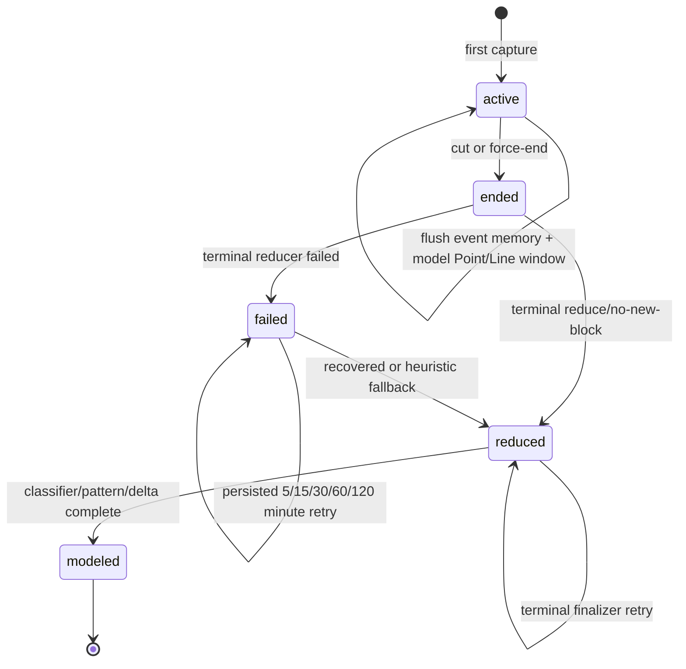

# Sessions and incremental modeling

A session is a bounded stretch of one person's focused activity. It is the
atomic unit for incremental reduction and personal modeling. Rows live in
`index.db.sessions`; capture dedup ensures an unchanged screen does not keep a
session alive.

## Boundary rules

`session/manager.py` applies three deterministic rules on every written capture
and every `session.tick_seconds` check:

1. **Idle gap:** no meaningful capture for `gap_minutes` (default 5) closes at
   the last event time.
2. **Single-app soft cut:** one unrelated app holds focus for
   `soft_cut_minutes` (default 3), unless at least two apps appeared in the
   preceding two minutes.
3. **Maximum duration:** `max_session_hours` (default 2) force-cuts a runaway
   session.

Shutdown and the 23:55 daily safety net also force-end an open session. If the
process crashes before shutdown can run, the next daemon boot closes every
stranded `active` row before accepting a new capture. Older rows close at the
next session's start; the newest closes at boot time.

## State machine

`status` remains `reduced` after modeling; `modeled_at` is the durable terminal
marker shown separately in the diagram.

## Incremental flush

Every `session.flush_minutes` (default 5, minimum 5), `run_flush_tick` reads
closed timeline blocks since `flush_end`, reduces them, and appends a
`[flush]` entry to `event-YYYY-MM-DD.md`. It advances `flush_end`; a failed flush
waits for the next, larger window. The terminal reduce only covers the trailing
range not already flushed.

After each successful flush, `writer.agent.model_active_session` extracts and
applies a memory delta over `[delta_end, flush_end)`. Successful apply advances
`delta_end`, so the next tick reads only new evidence. The same model lock used
by terminal finalization prevents a session-end race. The daemon remains
running throughout.

Under the default memory-delta model path there is no active classifier tick.
If an operator sets `memory_delta.apply_enabled=false`, the legacy classifier
task runs every `classifier.interval_minutes` and advances `classified_end`.

## Reducer recovery

Terminal reducer failures set `status=failed`, increment `retry_count`, retain
`last_error`, and write `next_retry_at`. The `reducer-retry` daemon task checks
once per minute. The retry schedule is 5, 15, 30, 60, and 120 minutes.

After the fifth failed attempt, the reducer writes an auditable `heuristic`
event entry and marks the session reduced. This is degraded state formation,
not a silent loss. The same result still enters terminal modeling.

The reducer task runs one unconditional catch-up pass at daemon boot, then
checks due retries once per minute. The 23:55 safety net also ignores backoff
and catches every stranded `ended` or `failed` row. `persome writer run` is the
same manual recovery entrance.

## Shared terminal finalizer

`writer.agent.finalize_session` is the only terminal model entrance. It is used
by:

- the asynchronous session-end callback;
- the one-minute reducer retry task;
- the daily safety net;
- `persome writer run`;
- `persome model build`.

It re-reads the session under a cross-process `flock`, skips a non-reduced row,
and returns success immediately when `modeled_at` already exists. It then runs
the enabled classifier compatibility path, pattern detector, and
`memory_delta.ensure_after_session`.

The finalizer runs even when the terminal reducer wrote no new entry, because a
long session may already be fully represented by flush entries. It also runs
after heuristic reducer exhaustion. Only a complete/benign result from every
enabled stage sets `modeled_at`.

Each window's memory-delta audit row is the retry boundary. A later active or
terminal pass reuses its post-gate payload and retries only deterministic apply;
it does not pay for a second LLM extraction or reinforce successful edges twice.
Terminal finalization starts at `delta_end`, so it only catches the trailing
unmodeled range.

## Session columns

| Column | Meaning |
|---|---|
| `status` | `active`, `ended`, `failed`, or `reduced`. |
| `start_time`, `end_time` | Bounded activity window. |
| `flush_end` | End of the latest reduced subwindow. |
| `classified_end` | Legacy classifier bookmark. |
| `pattern_detected_end` | Pattern detector bookmark. |
| `delta_end` | End of the latest successfully applied Point/Line window. |
| `retry_count`, `next_retry_at`, `last_error` | Persisted reducer recovery. |
| `modeled_at` | All terminal modeling stages completed. |

Fresh schema is generated in `docs/db-schema.sql`; upgrades add new columns
without dropping old product-era columns.

## Tuning

| Symptom | Setting |
|---|---|
| Focused sessions split too often | Raise `soft_cut_minutes`; multi-app work already has an exception. |
| Thinking pauses end sessions | Raise `gap_minutes`. |
| Normal deep work reaches timeout | Raise `max_session_hours`, but keep a finite bound. |
| Event memory is too delayed | Keep `flush_minutes` at 5; lower values are clamped. |

Session boundaries are deterministic Runtime compression boundaries, not
semantic labels or ground truth.
